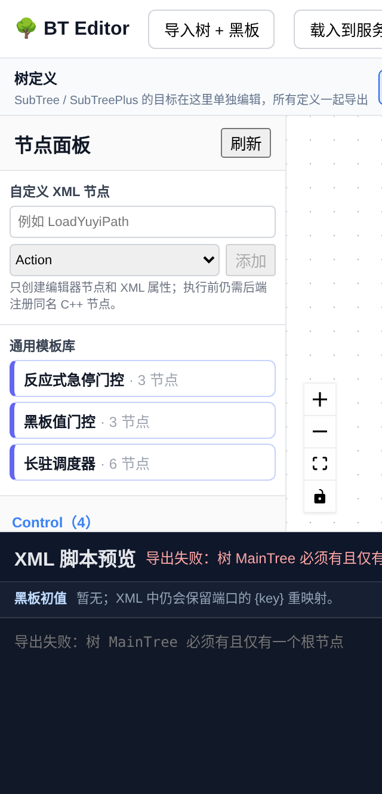
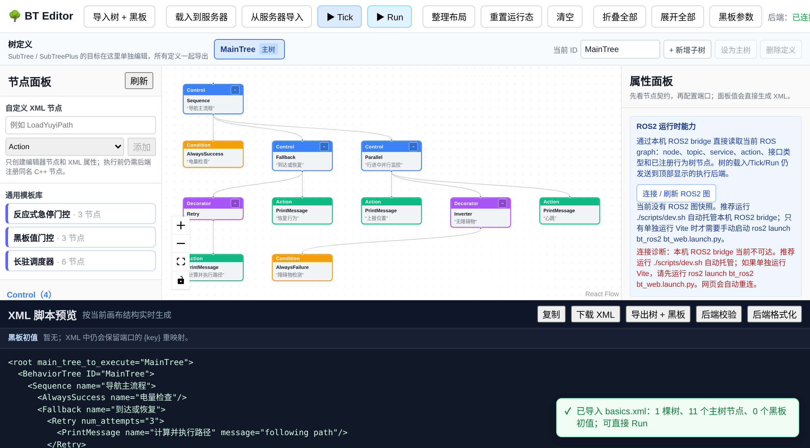
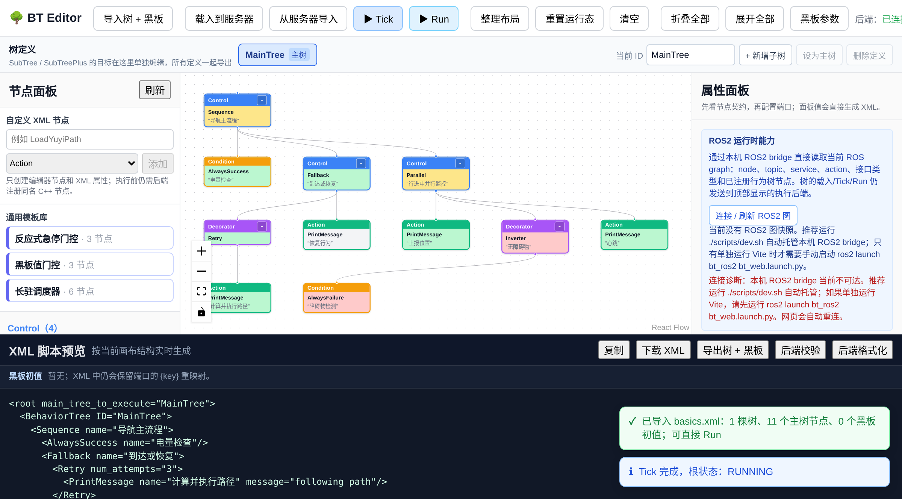

行为树基础
==========

本节面向第一次接触行为树的人。我们把"序列 / 选择 / 装饰 / 并行"这四类
核心节点讲清楚：它们各自解决什么问题、返回值怎么传播、在
BehaviorTree.CPP-X 里对应哪个实现。看完这一节，再去翻 :doc:`node_catalog`
的逐节点契约，就能把"概念"和"真实代码"对上。

为什么需要行为树
----------------

在行为树之前，机器人任务管理的主流方案是**有限状态机（FSM）**：用状态和
转移组织逻辑——"如果在充电状态且电量低于 20%，转移到充电行为"。

状态机的问题在**状态一多就变成蜘蛛网**。十几个状态之间的转移关系可能多达
上百条，改一个状态会影响一串转移，调试和维护都很痛苦。

行为树换了一种思路：**不用状态转移，而是用节点组合来组织逻辑**。每个节点
只关心自己那小块任务，节点之间如何协作由节点类型（而不是额外写死的转移
条件）决定。加一个新行为，只在树上挂一个新节点，不影响其他部分。这种
模块化让行为树成了游戏 AI（《光环 2》之后几乎成了标配）和机器人任务管理
（Nav2 用它编排整个导航流程）都采用的方案。

核心优势一句话概括：

* **模块化**——新行为 = 新节点，不碰旧逻辑。
* **反应式**——每个 tick 都从根重新评估，条件变了行为立刻变，不像状态机
  需要显式写转移条件。

状态只有四种
------------

行为树的每次执行脉冲叫 **tick**。每个节点 tick 后返回一个状态。本框架的
状态是封闭的四种（比常见的三态多一个 ``IDLE``）：

.. list-table::
   :header-rows: 1
   :widths: 20 80

   * - 状态
     - 含义
   * - ``IDLE``
     - 尚未执行或已被 halt 复位。
   * - ``RUNNING``
     - 异步动作还没完成，下一拍继续。这是行为树区别于普通状态机的关键。
   * - ``SUCCESS``
     - 节点任务完成，终结状态。
   * - ``FAILURE``
     - 节点任务失败，终结状态，父节点据此决定下一步。

节点分两大类
------------

* **控制节点（Control）**：负责"怎么组织子节点"，可以有多个或一个子节点。
* **执行节点（Leaf）**：真正干事，没有子节点，细分为 **条件** 和 **动作**。

项目里的节点类型枚举分四档：``Control`` / ``Decorator`` / ``Action`` /
``Condition``，正好覆盖上面两类。编辑器的节点面板就是按这四类分组的，分组和
计数来自后端 ``GET /api/nodes`` 的真实 manifest：

四种基本控制节点
----------------

下面四种是行为树的基石。每种都标注了在 BehaviorTree.CPP-X 里的对应类和
注册名，方便对照 :doc:`node_catalog`。

序列节点 Sequence（"与"语义，→）
~~~~~~~~~~~~~~~~~~~~~~~~~~~~~~~~

子节点从左到右依次执行，**全部成功才成功；任一失败即失败**。类似逻辑与 AND。

真实实现：``bt_nodes/control/sequence_node.hpp``（注册名 ``Sequence``）。

.. code-block:: text

   Sequence
   ├── 检查电量充足
   ├── 计算路径
   └── 执行导航

检查电量失败 → 后面的计算路径和执行导航都不做，整棵序列立即失败。

这个节点是**有状态**的：子节点返回 ``RUNNING`` 时保留游标，下一拍从该
子节点续跑，而不是每拍从头重启。这一点很重要——如果子节点是耗时的异步
动作（比如导航），每拍从头重跑会导致语义错误。

选择节点 Fallback（"或"语义，?）
~~~~~~~~~~~~~~~~~~~~~~~~~~~~~~~~

子节点从左到右依次尝试，**遇到第一个成功即成功；全部失败才失败**。类似
逻辑或 OR，从左到右是优先级从高到低。

真实实现：``bt_nodes/control/fallback_node.hpp``（注册名 ``Fallback``）。

.. code-block:: text

   Fallback
   ├── 直接到达目标
   ├── 重新规划路径
   └── 执行恢复行为

直接到达成功 → 后面步骤不再执行。到达失败 → 尝试重新规划。规划也失败 →
执行恢复行为。任何一级子节点返回 ``RUNNING``，整个 Fallback 也返回
``RUNNING`` 并暂停在这里。

并行节点 Parallel（⇉）
~~~~~~~~~~~~~~~~~~~~~~~

逻辑上"同时"推进所有子节点，按**阈值**判定整体结果。在 BehaviorTree.CPP-X
里，用户配置两个整数端口：

* ``success_count``（默认 ``-1``，表示全部成功）。
* ``failure_count``（默认 ``1``，表示任一失败即失败）。

真实实现：``bt_nodes/control/parallel_node.hpp``（注册名 ``Parallel``）。

.. code-block:: text

   Parallel success_count="2"
   ├── 导航到目标位置
   ├── 持续检测障碍物
   └── 上报当前位置

三个子任务并行推，2 个成功就算整棵并行成功。

.. note::

   这里的"并行"是**单线程逻辑并行**：同一拍，顺序 tick 每个子节点，用到
   ``RUNNING`` 状态保持未终结子节点跨拍推进。它**不是**真正的多线程。
   这是行为树并行节点的标准做法。真正需要多线程时，应在动作节点内部做
   异步，而不是指望 Parallel 开线程。成功与失败阈值同时满足时，**成功优先**。

反应式变体：ReactiveSequence / ReactiveFallback
~~~~~~~~~~~~~~~~~~~~~~~~~~~~~~~~~~~~~~~~~~~~~~~~~~~~

前面说过 ``Sequence`` 和 ``Fallback`` 是**有状态**的：子节点返回 ``RUNNING``
时保留游标续跑。这在"动作不该被打断"时是对的，但在"前置条件随时可能变化"
时就不够了——比如急停开关按下时，正在跑的导航动作必须立刻中止。

本框架为此提供了两个反应式变体，它们在子节点 ``RUNNING`` 时**立即 halt 并把
游标复位到 0**，下一拍从第一个子节点重新评估：

.. list-table::
   :header-rows: 1
   :widths: 24 38 38

   * - 控制节点
     - 与基础版的差异
     - 真实实现
   * - ``ReactiveSequence``
     - ``Sequence`` 保留游标续跑；本节点 ``RUNNING`` 时重头评估，让前置
       条件变假能立即打断当前动作。
     - ``bt_nodes/control/reactive_sequence_node.hpp``
   * - ``ReactiveFallback``
     - ``Fallback`` 保留游标续跑；本节点 ``RUNNING`` 时重头从第一个候选
       评估，让高优先级候选随数据变化立刻抢回执行权。
     - ``bt_nodes/control/reactive_fallback_node.hpp``

典型用法是把条件放在最前，动作放在后面：

.. code-block:: xml

   <ReactiveSequence name="急停门控">
     <CheckBool key="e_stop_clear" expected="true"/>
     <Delay delay_ms="5000"/>
   </ReactiveSequence>

``e_stop_clear`` 一旦变假，``Delay`` 会被立即 halt，而不是等它自然跑完。
如果这里换成普通 ``Sequence``，``Delay`` 返回 ``RUNNING`` 后游标就停在它
身上，条件根本不会被重新检查。

.. note::

   "反应式"这个词在行为树文献里指的就是这件事：每拍从根重新评估。本框架把
   它做成显式的节点类型，而不是让所有 ``Sequence`` 都变成反应式——因为
   "不该被打断的动作"同样常见，两种语义都要能表达。选择哪种取决于你希望
   前置条件在动作执行期间是否继续生效。

至此控制节点共 6 种：``Sequence``、``Fallback``、``Parallel``、
``PrioritySelector``、``ReactiveSequence``、``ReactiveFallback``。
前三种是本节讲的基础语义，后三种解决抢占和反应式重评估。

装饰节点 Decorator（◇）
-----------------------

装饰节点**只有一个子节点**，对子节点的结果做修饰或控制执行方式。本框架
内置八种：

.. list-table::
   :header-rows: 1
   :widths: 22 26 52

   * - 装饰器
     - 作用
     - 真实实现（注册名）
   * - ``Inverter``
     - 反转结果：``SUCCESS→FAILURE``、``FAILURE→SUCCESS``、``RUNNING`` 透传。
     - ``bt_nodes/decorator/inverter_node.hpp``
   * - ``Retry``
     - 子节点失败时最多重试 N 次（``num_attempts``，负数表示无限重试）。
     - ``bt_nodes/decorator/retry_node.hpp``
   * - ``Repeat``
     - 子节点成功后重复若干次（``num_cycles``，负数表示无限重复）。
     - ``bt_nodes/decorator/repeat_node.hpp``
   * - ``ForceSuccess``
     - 强制把子节点终态转成成功（``RUNNING`` 仍透传）。
     - ``bt_nodes/decorator/force_success_node.hpp``
   * - ``ForceFailure``
     - 强制把子节点终态转成失败。
     - ``bt_nodes/decorator/force_failure_node.hpp``
   * - ``TickRate``
     - 按 tier（``critical``/``normal``/``background``）或自定义周期降低
       子树的 tick 频率，是调度相关的装饰器。
     - ``bt_nodes/decorator/tick_rate_node.hpp``
   * - ``KeepRunningUntilFailure``
     - 子节点 ``SUCCESS``/``RUNNING`` 都返回 ``RUNNING`` 继续拖着跑，
       只在子节点 ``FAILURE`` 时结束。用于"持续监视/长驻调度"。
     - ``bt_nodes/decorator/keep_running_until_failure_node.hpp``
   * - ``KeepRunningUntilSuccess``
     - 与上一个对称：``FAILURE``/``RUNNING`` 都继续，子节点 ``SUCCESS``
       时结束。用于"等待某条件满足"。
     - ``bt_nodes/decorator/keep_running_until_success_node.hpp``

.. note::

   ``Repeat`` 和 ``KeepRunningUntilFailure`` 容易混淆：``Repeat`` 在子节点
   成功时**计数**并继续，到次数就结束；``KeepRunningUntilFailure`` 对成功
   **不计数**，只在失败时停。前者是"重复 N 次"，后者是"一直跑到出错"。

典型例子：抓取失败最多重试 3 次。

.. code-block:: xml

   <Retry num_attempts="3">
     <RequestGrasp/>
   </Retry>

注意 ``Retry`` 对"失败的完整尝试"计数，``RUNNING`` 不消耗次数；``0`` 仍
执行一次（首次照样执行，失败后不再重试）。

条件取反用 ``Inverter`` 很常见——把一个返回真的条件包成返回假：

.. code-block:: xml

   <Sequence>
     <Inverter>
       <CheckBool key="is_ready" expected="true"/>
     </Inverter>
     <StartWork/>
   </Sequence>

叶子节点：条件与动作
--------------------

控制节点下面的叶子节点才是真正干活的，分两种：

* **条件节点 Condition**——检查某个条件是否满足（电量是否充足、目标是否
  可见）。瞬时返回 ``SUCCESS``/``FAILURE``，不耗时。
* **动作节点 Action**——执行一个具体动作（发送速度指令、调用规划服务、
  发提示音）。通常需要时间，返回 ``RUNNING`` 直到完成。

条件节点常见的内置实现有 ``CheckBool``、``CompareBlackboard``、
``ScalarThreshold``、``BlackboardExists``、``CooldownCondition``；
动作节点有 ``SetBlackboard``、``SetBool``、``Counter``、``Delay``、
``PrintMessage`` 等，契约见 :doc:`node_catalog`。

执行机制：tick 怎么走
---------------------

行为树从根节点开始，按深度优先遍历。每个 tick（通常 10~20ms 一次）执行
一遍整棵树。各节点处理返回值的方式：

* **Sequence**：从第一个子节点开始；子节点 ``RUNNING`` 时保留游标续跑，
  ``FAILURE`` 立即失败并复位。
* **Fallback**：从第一个子节点开始；``FAILURE`` 尝试下一个，
  ``RUNNING`` 暂停在这里。
* **Decorator**：先执行唯一的子节点，再按装饰规则处理返回值。
* **叶子**：条件瞬时返回；动作可能返回 ``RUNNING``。

这样一个简化版序列节点的 tick 逻辑就能理解（真实代码见
``bt_nodes/control/sequence_node.hpp``）：

.. code-block:: cpp

   NodeStatus tick() override {
     while (current_child_idx_ < children_.size()) {
       auto& child = children_[current_child_idx_];
       const NodeStatus s = child->executeTick();
       if (s == NodeStatus::RUNNING) {
         return NodeStatus::RUNNING;   // 异步未完成：保留游标
       }
       if (s == NodeStatus::FAILURE) {
         haltChildren();
         current_child_idx_ = 0;
         return NodeStatus::FAILURE;
       }
       ++current_child_idx_;           // 成功，推进下一个
     }
     current_child_idx_ = 0;
     return NodeStatus::SUCCESS;       // 全部成功
   }

黑板与端口：节点间怎么通信
--------------------------

节点本身保持"无状态可复用"。节点之间、节点与外部世界之间交换数据走
**黑板（Blackboard）**——一个以字符串为 key、类型安全（``std::any`` +
类型擦除校验）的共享 KV 存储。真实实现见 ``bt_core/include/bt_core/blackboard.hpp``。

节点不直接碰黑板 key，而是通过**端口名**间接访问，端口名在树文件里可被
重映射到不同的黑板 key：

.. code-block:: xml

   <ComputePath goal="{goal}" path="{path}"/>
   <FollowPath path="{path}"/>

``ComputePath`` 把算好的路径写到黑板 `path`，``FollowPath`` 从黑板读
`path`，两个动作节点通过黑板通信，互不直接依赖。

.. warning::

   端口只写**字面量**（如 ``message="hello"``）时，值保存在节点本地
   ``port_values``，**不进共享黑板**；只有写成 ``{key}`` 形式才重映射到
   黑板。这是刻意设计——否则两个 ``<PrintMessage message="A"/>`` 和
   ``<PrintMessage message="B"/>`` 会因为都用端口名 ``message`` 当 key 而在
   黑板里互相覆盖。这也是 BehaviorTree.CPP 私有端口语义的由来。

完整例子：一棵简化导航树
------------------------

下面这棵树的形状对应 Nav2 里"带重规划的导航"思路。其中
``ComputePath`` / ``FollowPath`` 是业务自定义节点（本框架不含），仅示意
结构；其余都是真实的规范节点。

.. code-block:: xml

   <root main_tree_to_execute="MainTree">
     <BehaviorTree ID="MainTree">
       <Sequence name="navigate_with_replanning">
         <CheckBool key="battery_ok" expected="true"/>
         <Retry num_attempts="3">
           <Sequence>
             <ComputePath goal="{goal}" path="{path}"/>
             <FollowPath path="{path}"/>
           </Sequence>
         </Retry>
         <ClearBlackboard key="path"/>
       </Sequence>
     </BehaviorTree>
   </root>

执行流程：先检查电量；电量够则尝试"算路径 + 走路径"，任一失败就重试，
最多 3 次；3 次都失败则清除黑板的 `path` 清理现场。整棵树结束后，等下一
个 tick 重新从根评估。注意黑板变量 ``{goal}`` 和 ``{path}``——规划节点
写入、跟随时读取，两个节点靠黑板通信而不是直接耦合。

扩展调度能力
------------

除了四类基础节点，本框架还额外提供两个与调度相关的节点，适合实际机器人
场景：

* ``PrioritySelector``——每拍从第一个子节点重评，高优先级输入抢占低优先级
  运行分支（不是简单从左到右扫一次），见
  ``bt_nodes/control/priority_selector_node.hpp``。
* ``TickRate``——给子树分级降频（critical 每拍、normal 每 2 拍、background
  每 5 拍），避免低优先级逻辑拖慢整棵树，见
  ``bt_nodes/decorator/tick_rate_node.hpp``。

这两者的完整用法见 :doc:`scheduling`。

高频追问
--------

**Q：行为树和状态机的核心区别是什么？**
A：状态机用状态转移组织逻辑，行为树用节点组合组织逻辑。行为树的优势是
模块化（加新行为不改旧逻辑）和反应式（条件变了行为自动变）。

**Q：行为树的 tick 频率一般设多少？**
A：取决于任务需求和节点成本。Nav2 默认约 10~20Hz（50~100ms 一次）。避障
要求高可以跑快一点；用 ``TickRate`` 可以把非关键子树降频，无需全局加速。

**Q：行为树怎么处理并发任务？**
A：用 ``Parallel``。但它的子节点共享同一个执行线程，是逻辑并行，不是
真正的多线程。需要真多线程时，在动作节点内部实现异步。

**Q：行为树的黑板是什么？**
A：行为树的全局数据共享机制。节点之间通过黑板读写数据，比如规划器把路径
写到黑板、控制器从黑板读路径。黑板避免了节点之间的直接耦合。本框架的黑板
支持类型检查，端口映射区分字面量和 ``{key}`` 重映射。

**Q：看到控制节点里还有"选择"和"序列"，它们和装饰节点有什么区别？**
A：序列/选择/并行是**控制节点**，可以有多个子节点，决定"怎么组织多个
子节点"；装饰节点**只有一个子节点**，决定"怎么修饰一个子节点的结果"。
两者角色不同，不能混用。

动手：跑一棵真实的树
--------------------

概念看完就该跑起来。下面每条命令都在本仓库实测通过，产出可以直接对照。

先构建核心库、节点插件和示例程序：

.. code-block:: bash

   cmake -S . -B build \
     -DBT_BUILD_NODES=ON -DBT_BUILD_SERVER=ON -DBT_BUILD_TESTS=ON -DBT_BUILD_EXAMPLES=ON
   cmake --build build

或者直接用一键脚本（额外装前端依赖和 Playwright 浏览器）：

.. code-block:: bash

   ./scripts/bootstrap.sh

最小控制流：Sequence + Fallback
~~~~~~~~~~~~~~~~~~~~~~~~~~~~~~~

``examples/trees/minimal_sequence_fallback.xml`` 是最小的"选择 + 序列"闭环：

.. code-block:: xml

   <root main_tree_to_execute="MinimalTree">
     <BehaviorTree ID="MinimalTree">
       <Fallback name="choose_patrol_or_idle">
         <Sequence name="patrol_path">
           <AlwaysSuccess name="precheck_ok"/>
           <PrintMessage name="say_patrol" message="patrol path selected"/>
         </Sequence>
         <PrintMessage name="say_idle" message="fallback idle path"/>
       </Fallback>
     </BehaviorTree>
   </root>

运行（Linux 用 ``.so``，macOS 用 ``.dylib``）：

.. code-block:: bash

   ./build/bin/example_load_xml \
     ./build/lib/libbt_nodes.so \
     ./examples/trees/minimal_sequence_fallback.xml

实际输出：

.. code-block:: text

   已加载插件，注册节点数: 34
   树构建完成，节点数: 5
   === 执行行为树 ===
       [状态变化] 节点#3: IDLE -> SUCCESS
   [PrintMessage] patrol path selected
       [状态变化] 节点#4: IDLE -> SUCCESS
       [状态变化] 节点#2: IDLE -> SUCCESS
       [状态变化] 节点#2: SUCCESS -> IDLE
       [状态变化] 节点#1: IDLE -> SUCCESS
   === 根节点结果: SUCCESS ===

对照前面的概念：``Fallback`` 的第一个子节点（``Sequence``）成功了，所以
第二个 ``PrintMessage``（idle 分支）**完全没有执行**——输出里只有
``patrol path selected``。这就是"或"语义的短路。

观察 RUNNING：异步语义
~~~~~~~~~~~~~~~~~~~~~~

``examples/trees/diagnostic_demo.xml`` 里有 ``Delay delay_ms="20"``，能看到
真实的跨 tick ``RUNNING``：

.. code-block:: bash

   ./build/bin/example_load_xml \
     ./build/lib/libbt_nodes.so \
     ./examples/trees/diagnostic_demo.xml

输出末尾能看到 ``RUNNING -> SUCCESS`` 的转换：

.. code-block:: text

       [状态变化] 节点#7: RUNNING -> SUCCESS
   [INFO] 诊断流程完成，目标缓存已清理
       [状态变化] 节点#1: RUNNING -> SUCCESS
   === 根节点结果: SUCCESS ===

注意根节点 ``#1``（那个 ``Sequence``）也经历了 ``RUNNING``——因为它的子节点
``Delay`` 返回 ``RUNNING`` 时，序列保留游标并把 ``RUNNING`` 向上传播。
``example_load_xml`` 用 ``tree.tickWhileRunning()`` 反复 tick 到收敛，这正是
真实机器人里定时器周期 tick 的简化版。

.. tip::

   想验证"序列是有状态的"，把 ``delay_ms`` 调大到 ``2000`` 再跑一次。你会看到
   ``Delay`` 之前的节点**不会**被重复执行——它们的 ``SUCCESS`` 已经被游标记住了。

Web 编辑器：可视化搭建
----------------------

命令行能跑树，但拖拽搭树、看运行态上色更直观。这是本框架的可视化闭环。

一键启动
~~~~~~~~

.. code-block:: bash

   ./scripts/dev.sh

脚本会构建后端、加载 ``libbt_nodes`` 插件、启动 Vite，并打印两个地址：

* 后端 API：``http://127.0.0.1:8080``
* 编辑器：``http://127.0.0.1:5173``

浏览器打开 5173 就能看到编辑器。退出时脚本会清理子进程。

手动启动（两个终端）
~~~~~~~~~~~~~~~~~~~~

需要自定义端口或插件路径时分开启动：

.. code-block:: bash

   # 终端 1：后端 + 插件
   ./build/bin/bt_server 127.0.0.1 8080 ./build/lib/libbt_nodes.so

   # 终端 2：前端
   cd bt_editor && npm run dev

``bt_editor/vite.config.ts`` 默认把 ``/api`` 代理到 ``http://localhost:8080``；
后端换地址时给 dev/preview 设置 ``BT_BACKEND_URL``。本地树文件 API 默认限制在
``examples/trees``，换目录用 ``BT_TREE_WORKSPACE=/path/to/trees``。

四种基本节点长什么样
~~~~~~~~~~~~~~~~~~~~

下面这棵树把本节讲的四类节点放在了一起：外层是"与"语义的 ``Sequence``，
中间是"或"语义的 ``Fallback`` 搭配装饰器 ``Retry``，内层是按阈值判定的
``Parallel`` 搭配装饰器 ``Inverter``，叶子则是条件和动作。对照画布看概念会
直观很多：

点 ``Tick`` 执行一拍后，每个节点按状态上色。这张图刻意混合了四种状态，
正好对应前面的状态表：绿色 ``SUCCESS``、黄色 ``RUNNING``、红色 ``FAILURE``、
灰色 ``IDLE`` 表示本拍没走到：

注意被 ``Inverter`` 包裹的那个条件：子节点 ``AlwaysFailure`` 返回
``FAILURE``，装饰器把它反转成 ``SUCCESS`` 向上汇报。画布同时显示两者各自的
真实状态，这比只看最终结果更容易理解装饰器在做什么。

.. note::

   这两张图由 ``bt_editor/e2e/basics-screenshots.spec.ts`` 用 mocked API
   生成，固定 viewport 和固定 manifest，所以不受本机端口、进程和数据波动
   影响。重建方式见下面的"文档配图怎么重建"。

在界面里做什么
~~~~~~~~~~~~~~

编辑器的节点面板**不是硬编码的**——启动时拉 ``GET /api/nodes``，把后端真实
注册的节点按 Control/Decorator/Action/Condition 分组列出。新写的插件节点重启
后端就会自动出现。

典型工作流：

.. list-table::
   :header-rows: 1
   :widths: 22 78

   * - 操作
     - 说明
   * - 拖拽建树
     - 从左侧面板拖节点到画布。连线时前端强制结构约束：叶子无子节点、
       装饰器恰好一个子节点、控制节点多子节点、禁止自环。
   * - 编辑端口
     - 选中节点后属性面板按 manifest 渲染控件。普通输入端口可在
       "固定值 / 读取黑板"之间切换；输出端口填目标黑板键，面板生成 ``{key}``。
   * - ``XML 脚本预览``
     - 实时显示当前画布导出的 XML，改一处立刻看到脚本变化。
   * - ``整理布局``
     - 按树层级重新排版画布，保持兄弟节点稳定顺序。
   * - ``后端校验`` / ``后端格式化``
     - 调 ``/api/tree/validate`` 和 ``/api/tree/format``，只校验或只格式化，
       不替换当前运行树。
   * - ``Tick`` / ``Run``
     - ``Tick`` 单拍执行；``Run`` 跑到终态并返回完整状态变化序列。
       节点按状态上色：运行黄、成功绿、失败红、空闲灰。
   * - ``黑板参数``
     - 填写当前树的启动初值（``string``/``bool``/``int``/``double``），
       绑定进 XML 的 ``TreeNodesModel/Blackboard`` 元数据区。
   * - ``下载 XML`` / ``导出树 + 黑板``
     - 分别下载纯 XML 和版本化 ``.bt.json`` 配置包。

.. note::

   ``./scripts/dev.sh`` 启动的普通 ``bt_server`` 只加载 ``bt_nodes`` 里的非 ROS
   插件节点。它**不能**执行需要 ``rclcpp::Node`` 句柄的 ROS2 节点（``ReadScalar``、
   ``IsFlagTrue``、``RosTopicAction`` 等）。那些 XML 要交给 ``BtExecutorNode``
   运行，见 :doc:`ros2_recharge_tutorial`。编辑器里能看到 ROS manifest 是为了
   设计和端口配置，不代表普通后端具备 ROS 执行能力。

后端 API 一览
~~~~~~~~~~~~~

编辑器的每个动作背后都是一个 HTTP 接口，也可以直接用 ``curl`` 调：

.. code-block:: text

   GET  /api/health              健康检查
   GET  /api/nodes               枚举已注册节点 + 端口 manifest
   POST /api/tree/load           XML -> 构建树
   POST /api/tree/validate       只校验，不替换当前树
   POST /api/tree/format         稳定缩进格式化
   GET  /api/tree/export         当前树 -> XML
   POST /api/tree/tick           tick 一次，返回每节点状态
   POST /api/tree/run            跑到终态，返回状态变化序列
   GET  /api/tree/structure      当前树的父子结构
   GET  /api/trees               列出 workspace 里的树文件
   GET  /api/tree/open?name=...  读取一个树文件
   POST /api/tree/save           保存树文件

完整契约见 :doc:`api_reference`。

GitHub Actions 与文档发布
-------------------------

这个仓库的验证和文档站都由 GitHub Actions 驱动。理解这两条流水线，改完
代码或文档才知道该看哪个 job。

两条工作流
~~~~~~~~~~

.. list-table::
   :header-rows: 1
   :widths: 16 20 30 34

   * - 工作流
     - 文件
     - 触发
     - 做什么
   * - ``ci``
     - ``.github/workflows/ci.yml``
     - push 到 ``main``、任意 PR、手动
     - 在 ubuntu-latest 和 macos-latest 双平台跑
       ``./scripts/test.sh`` 全量非 ROS 验证；失败时上传 Playwright 诊断
       artifact（保留 14 天）。
   * - ``pages``
     - ``.github/workflows/pages.yml``
     - push 到 ``main`` 且改动 ``docs/**`` 或构建脚本、手动
     - ``build`` job 跑 ``./scripts/build_pages.sh`` 产出站点并上传
       artifact；``deploy`` job 通过 ``github-pages`` Environment 发布。

``ci`` 的 ``./scripts/test.sh`` 覆盖 C++ 构建、Release ``ctest``、ASan/UBSan
focused suite、SDK 外部 consumer、``bt_server`` 真实进程 API smoke、ROS2 launch
语法解析、Vitest、前端 build、mocked Playwright 三轮 + live-backend + 截图
hash gate，以及 Sphinx HTML 和 linkcheck。

本地先跑，别等 CI
~~~~~~~~~~~~~~~~~

CI 跑的就是仓库里的脚本，本地完全可以复现：

.. code-block:: bash

   ./scripts/test.sh          # 等价于 ci 工作流的核心步骤
   ./scripts/build_docs.sh    # Sphinx HTML + linkcheck（warning-as-error）
   ./scripts/build_pages.sh   # 额外产出 docs/_build/pages 发布产物

只改文档时至少跑 ``./scripts/build_docs.sh``。它用 ``-W`` 把警告当错误，
所以标题下划线过短、坏掉的 ``:doc:`` 交叉引用都会当场失败，而不是等
``pages`` 工作流红掉才发现。

文档配图怎么重建
~~~~~~~~~~~~~~~~

本页的界面截图不是手工截的，而是由 Playwright 用 mocked API 复现产出，因此
改了 UI 之后能一条命令重建：

.. code-block:: bash

   cd bt_editor
   npm run screenshots

这条命令做三件事：先 ``npm run build`` 确保验证的是当前前端产物，再用
``BT_UPDATE_SCREENSHOTS=1`` 跑 ``docs-screenshots.spec.ts`` 和
``basics-screenshots.spec.ts``，最后跑 ``npm run screenshots:check`` 门禁。

门禁（``e2e/check-screenshot-hashes.mjs``）会拒绝：

* 文件缺失或过小（< 10KB，通常意味着截了一张空白页）。
* 不是合法 PNG（校验签名和 IHDR 头）。
* 尺寸与预期不符（防止 viewport 或 ``deviceScaleFactor`` 被改动后静默产出不同尺寸）。
* 出现内容完全相同的两张图（防止"四个状态"其实是同一屏截了四次）。

.. code-block:: bash

   # 只校验，不重新生成
   npm run screenshots:check

   # 产出到临时目录，不动已提交的图片
   BT_UPDATE_SCREENSHOTS=1 BT_SCREENSHOT_DIR=/tmp/shots \
     npx playwright test e2e/basics-screenshots.spec.ts --project=chromium

.. warning::

   ``docs/blog/screenshots/`` 下的 ``05`` 到 ``14`` 是早期手工补充的图片，
   没有对应的生成 spec，因此**不在** hash 门禁清单内。新增文档配图请写进
   spec 并登记到门禁，不要直接放一个无源 PNG 进仓库——否则 UI 改动后没人
   知道哪张图已经过期。

这些截图用的是 mocked API，只保证界面渲染稳定， **不能** 当作后端功能证据。
浏览器到真实 C++ 后端的闭环由独立的 live 项目验证：

.. code-block:: bash

   cd bt_editor
   npm run test:e2e:live

它会真启动 ``bt_server`` + ``libbt_nodes``，检查真实 manifest、示例
load/validate/tick、Run 和严格 XML 错误。详见 :doc:`editor_playwright`。

Pages 发布模型
~~~~~~~~~~~~~~

GitHub Pages **不直接发布** ``docs/`` 源码或 ``docs/_build/html``。发布链路是：

1. ``scripts/build_pages.sh`` 构建 HTML 并筛选出干净产物到 ``docs/_build/pages``。
2. ``actions/upload-pages-artifact@v3`` 上传该目录。
3. ``actions/deploy-pages@v4`` 经 ``github-pages`` Environment 发布。

产物根目录必须直接含 ``index.html`` 和 ``.nojekyll``（GitHub Pages 只有在
禁用 Jekyll 时才提供以 ``_`` 开头的路径），另含 ``_static/``、``_images/``、
其余 HTML 和 ``searchindex.js``。构建缓存、``_sources/``、``.buildinfo`` 和
``objects.inv`` 不进 artifact。

站点地址：https://lovelyyoshino.github.io/behavior_tree_cpp/

仓库需要的远端设置
~~~~~~~~~~~~~~~~~~

自动发布依赖两处 GitHub 设置，它们 **不能** 在 workflow YAML 里声明：

1. ``Settings -> Pages``：``Build and deployment -> Source`` 选
   ``GitHub Actions``。
2. ``Settings -> Environments -> github-pages``：在
   ``Deployment branches and tags`` 里允许 ``main``。

看懂 Deploy 失败
~~~~~~~~~~~~~~~~

如果 ``Build Pages artifact`` 成功、而 ``Deploy to GitHub Pages`` 报：

.. code-block:: text

   Branch "main" is not allowed to deploy to github-pages due to environment protection rules.

说明 Sphinx 构建和 artifact 都没问题， **唯一** 失败点是 Environment 的分支
规则。按上一节允许 ``main``，然后在失败的 run 里点 ``Re-run failed jobs``。
不需要改 Sphinx、重生成截图或切到 ``gh-pages`` 分支。

用 CLI 查状态
~~~~~~~~~~~~~

装了 ``gh`` 可以不开浏览器就确认部署结果：

.. code-block:: bash

   # 最近几次 pages 运行
   gh run list --workflow=pages --branch=main --limit 5

   # 看某次 run 的每个 job 和步骤
   gh run view <run-id>

   # 只看结论
   gh run view <run-id> --json status,conclusion --jq '{status,conclusion}'

   # 手动触发一次发布
   gh workflow run pages --ref main

两个 job（``Build Pages artifact`` 和 ``Deploy to GitHub Pages``）都是
``success`` 才算真正发布成功。只看整体 ``conclusion`` 会漏掉"构建成功、
部署被 Environment 拦住"这种情况。

.. warning::

   ``pages`` 工作流的 ``concurrency`` 组是 ``pages`` 且
   ``cancel-in-progress: true``。连续 push 文档时，前一次运行会被取消，
   这是预期行为，不是失败。

备用分支模式
~~~~~~~~~~~~

只有把 ``Settings -> Pages`` 的 Source 明确改成 ``Deploy from a branch``
之后，才使用 ``gh-pages`` 分支：先跑 ``./scripts/build_pages.sh``，再把
``docs/_build/pages/`` 的**内部内容**放到 ``gh-pages`` 根目录。

GitHub Actions 模式和 ``gh-pages`` 分支模式二选一。本仓库的标准模式是
GitHub Actions。更多细节见 :doc:`pages_deployment`。

下一步
------

概念清楚了，接下来：

* 到 :doc:`node_catalog` 看每个内置节点的逐项契约（端口、状态转换、失败
  边界、最小 XML）。节点清单以运行时 ``GET /api/nodes`` 为准，不要依赖
  文档里的固定数字。
* 到 :doc:`scheduling` 看优先级抢占与 tick 分级，以及多输入抢占怎么收敛到
  一棵树。
* 到 :doc:`quickstart` 走完整的一键准备、验证和启动流程。
* 到 :doc:`editor_playwright` 看编辑器的浏览器级验证怎么做。
* 到 :doc:`developer_workflow` 固化"加节点 - 补测试 - 跑 gate"的开发循环。

行为树的核心信条只有一句：**节点只做自己的事，如何协作由节点类型决定。**
把这条守住，后面设计模式和实战应用就好懂了。
