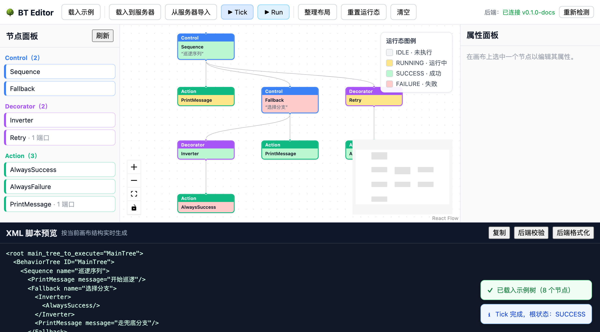

# BehaviorTree.CPP-X：从零写一个插件化、ROS 解耦的 C++ 行为树框架

> 一篇带你走完整个设计与实现的工程笔记。我们要做的不是又一个行为树库，而是一个**核心零依赖、节点可热插拔、带 Web 可视化编辑器、还能可选封装成 ROS2 节点**的框架。

---

## 写在前面：我们到底要什么

行为树（Behavior Tree）是游戏 AI 和机器人决策里最常用的结构之一。市面上 `BehaviorTree.CPP` 已经很成熟，但这个项目想验证四件事，对应四个明确的工程目标：

1. **可视化控制 + 插件式增删节点和连线** —— 一个 Web 编辑器，节点从后端动态枚举，拖拽连线，导入导出。
2. **完全不依赖 ROS，但能选装 ROS2 wrapper** —— 核心库纯 C++17，ROS2 能力是独立可选包。
3. **每个"状态/节点"以插件形式插入，扩展要快** —— 节点编译成动态库，运行时加载自注册，加新节点不用重编主程序。
4. **充足注释 + 详细文档** —— 就是你正在读的这篇。

下面按"为什么这样设计 → 怎么实现 → 怎么验证"的顺序展开。

---

## 一、整体架构：一张图看懂边界

```
┌─────────────────────────────────────────────────────────┐
│  bt_editor (React + TS + React Flow)   ← 浏览器           │
└───────────────▲─────────────────────────────────────────┘
                │ HTTP / JSON 控制协议
┌───────────────┴─────────────────────────────────────────┐
│  bt_server (cpp-httplib)  /api/nodes /tree/load /tick ... │
└───────────────▲─────────────────────────────────────────┘
                │ C++ API
┌───────────────┴─────────────────────────────────────────┐
│  bt_core (零 ROS 依赖)                                    │
│   TreeNode / Control / Decorator / Leaf                   │
│   Blackboard  NodeFactory  PluginLoader  Tree  XmlParser  │
└───────────────▲───────────────────────────┬──────────────┘
                │ dlopen 动态加载             │ 可选
┌───────────────┴───────────────┐   ┌────────┴──────────────┐
│  bt_nodes (内置节点插件 .so)   │   │  bt_ros2 (rclcpp 封装) │
└───────────────────────────────┘   └───────────────────────┘
```

**这张图最重要的不是有什么，而是箭头方向。** `bt_core` 向上不知道 server，向下不知道具体节点，向旁不知道 ROS。所有耦合只通过"工厂注册 + 抽象接口"完成。这是目标 2、3 能成立的根本：核心不认识任何具体实现，自然就不依赖它们。

---

## 二、核心抽象 bt_core：四块积木

### 2.1 NodeStatus：一切的起点

行为树的每次执行脉冲叫 tick，每个节点 tick 后返回一个状态。状态只有四种，封闭且语义清晰：

```cpp
enum class NodeStatus { IDLE, RUNNING, SUCCESS, FAILURE };
```

- `RUNNING` 是行为树区别于普通状态机的关键——它表示"异步动作还没完成，下一拍继续"。
- `SUCCESS`/`FAILURE` 是终结状态，父节点据此决定下一步。

### 2.2 TreeNode：所有节点的基类

```cpp
class TreeNode {
 public:
  virtual NodeStatus tick() = 0;       // 子类实现具体逻辑
  virtual NodeType   type() const = 0; // 控制/装饰/动作/条件
  virtual void       halt();           // 中止 RUNNING 的子树
  NodeStatus executeTick();            // 框架入口：tick + 维护状态 + 触发回调
  // 端口读写：getInput<T> / setOutput<T>
};
```

注意我们区分了 `tick()`（子类逻辑）和 `executeTick()`（框架入口）。后者负责更新状态机并触发**状态变化回调**——这个回调就是后面 bt_server 能把运行态实时推给前端高亮的机制。

### 2.3 三大族：Control / Decorator / Leaf

| 族 | 子节点数 | 典型成员 | 你的"状态"对应谁 |
|----|---------|---------|----------------|
| Control | N 个 | Sequence / Fallback / Parallel | |
| Decorator | 1 个 | Inverter / Retry / Repeat | |
| Leaf | 0 个 | **Action** / Condition | ← **每个状态 = 一个 Action 节点插件** |

### 2.4 Blackboard：节点间共享数据 + 端口机制

节点本身应该是"无状态可复用"的。数据交换走**黑板**——一个类型安全的 KV 存储。节点不直接碰黑板 key，而是通过**端口名**间接访问，端口名在 XML 里可被重映射：

```xml
<MoveTo target="{goal_pos}"/>   <!-- 端口 target 重映射到黑板 key goal_pos -->
<SayHello message="hello"/>      <!-- 字面量值，节点私有 -->
```

> **一个踩过的坑（私有端口）**：早期实现把字面量值也写进共享黑板，结果一棵树里两个 `<PrintMessage message="A"/>` 和 `<PrintMessage message="B"/>` 因为都用端口名 `message` 作 key，在黑板里互相覆盖了。修复方案是：**字面量值存进节点本地（不进共享黑板），只有显式 `{k}` 重映射才走黑板**。这正是 BehaviorTree.CPP 私有端口语义的由来。

---

## 三、插件系统：目标 3 的核心

这是整个框架最关键的机制——**怎么让"加一个新节点"不需要重新编译主程序**。

### 3.1 写一个节点有多简单

```cpp
#include "bt_core/leaf_node.hpp"
#include "bt_core/plugin_register.hpp"
using namespace bt_core;

class SayHello : public ActionNode {
 public:
  using ActionNode::ActionNode;
  static PortsList providedPorts() {                 // ① 声明端口（可选）
    return makePorts(InputPort<std::string>("message", "hi", "要打印的话"));
  }
  NodeStatus tick() override {                       // ② 实现逻辑
    std::cout << getInput<std::string>("message").value_or("hi") << "\n";
    return NodeStatus::SUCCESS;
  }
};

BT_REGISTER_NODES(factory) {                         // ③ 一行注册（插件入口）
  factory.registerNodeType<SayHello>("SayHello");
}
```

把它编译成动态库，就这样：

```cmake
add_library(my_nodes SHARED my_nodes.cpp)
target_link_libraries(my_nodes PRIVATE bt::core)
```

### 3.2 运行时是怎么加载的

`BT_REGISTER_NODES` 宏展开成一个 `extern "C"` 的导出函数 `BT_RegisterNodes`（用 C 链接避免 name mangling 跨编译器找不到符号）。`PluginLoader` 做三件事：

1. `dlopen`（POSIX）/ `LoadLibrary`（Windows）打开库；
2. `dlsym` 找到 `BT_RegisterNodes` 符号；
3. 调用它，把库里的节点注册进 `NodeFactory`。

```cpp
NodeFactory factory;
factory.loadPlugin("libmy_nodes.dylib");   // 加载后 factory 里就有 SayHello 了
auto node = factory.createNode("SayHello", "inst1", config);
```

> **另一个踩过的坑（析构顺序）**：动态库一旦 `dlclose`，它注册进工厂的构造器（`std::function` 闭包）和节点 vtable 就指向已卸载的内存。如果库比工厂先析构，程序退出时会段错误。修复方案是：**让 `NodeFactory` 自己持有库句柄，且作为第一个声明的成员**（C++ 成员析构是声明逆序，所以它最后析构）。这样工厂的注册表一定先于库卸载而销毁。所以请优先用 `factory.loadPlugin()` 而不是手动管理句柄。

---

## 四、序列化 XmlParser：和 Groot 生态互通

树文件用 XML，格式兼容 `BehaviorTree.CPP` / Groot：

```xml
<root main_tree_to_execute="MainTree">
  <BehaviorTree ID="MainTree">
    <Sequence name="root">
      <BatteryOK level="20"/>
      <Inverter>
        <NeedRecharge/>
      </Inverter>
    </Sequence>
  </BehaviorTree>
</root>
```

规则很简单：标签名 = 节点注册名（经工厂实例化），属性 = 端口（`"{k}"` 是重映射，否则是字面量），子元素按顺序成为子节点。`XmlParser` 提供 `loadFromText/loadFromFile` 和 `writeToText/writeToFile`，双向转换。底层用 vendored 的 tinyxml2，无需额外联网安装。

---

## 五、可视化编辑器 bt_editor：目标 1

前端是 React + TypeScript + React Flow，通过 HTTP 和 `bt_server` 通信。核心交互：

- **节点面板**：启动时拉 `GET /api/nodes`，按 Control/Decorator/Action/Condition 分组，拖拽到画布。新增的插件节点会**自动出现**在面板里——这就是"插件式增删节点"。
- **画布连线**：React Flow 画布，连线时强制结构约束（叶子无子、装饰单子、控制多子、禁自环）。
- **属性面板**：选中节点编辑端口值（字面量或 `{黑板key}`）。
- **导入导出**：画布树 ↔ XML，对接 `/api/tree/load` 和 `/api/tree/export`。
- **运行态高亮**：点 Tick 调 `/api/tree/tick`，按返回的每节点状态上色（运行黄 / 成功绿 / 失败红 / 空闲灰）。

后端 `bt_server` 基于 header-only 的 cpp-httplib，当前核心接口：

| 接口 | 作用 |
|------|------|
| `GET /api/health` | 健康检查 |
| `GET /api/nodes` | 枚举已注册节点 + 端口（编辑器据此渲染面板） |
| `POST /api/tree/load` | XML → 构建树 |
| `GET /api/tree/export` | 当前树 → XML |
| `POST /api/tree/tick` | tick 一次，返回每节点状态 |
| `POST /api/tree/run` | 从 IDLE 跑到终结并返回状态变化序列 |
| `GET /api/tree/structure` | 返回当前树的父子结构 |

---

## 六、ROS2 wrapper bt_ros2：目标 2 的"可选"那一半

核心库零 ROS 依赖，那 ROS2 能力怎么来？答案是一个**独立的 ament_cmake 包** `bt_ros2`，它依赖 `bt_core` 但反过来 `bt_core` 完全不知道它的存在。

- `BtExecutorNode`：继承 `rclcpp::Node`，用 ROS2 timer 周期 tick 行为树，把根状态发布到 topic，从 ROS2 param 读取要加载的 XML 路径和频率。
- **可复用数据接入基类**（这次重点设计的）：
  - `RosConditionNode<MsgT>` —— 把 ROS2 话题数据当条件用，子类**只需实现 `evaluate(msg)->bool`**
  - `RosInputNode<MsgT>` —— 把 ROS2 话题数据录入黑板，子类**只需实现 `onData(msg)`**（里面 `setOutput` 写黑板）
  - 自带 `topic` / `timeout_ms` / `qos_depth` 三个公共端口，**数据新鲜度**判定（`data_freshness.hpp` 纯逻辑、可独立单测）一并内置，传感器掉线自动失败
  - 4 个开箱即用范例：`IsObstacleClose` / `IsFlagTrue` / `ReadBattery` / `ReadScalar`，照抄模板改消息类型即可
- **关键技巧**：适配器节点拿不到 ROS 句柄怎么办？`BtExecutorNode` 建树前把 `rclcpp::Node*`（非拥有裸指针，避免循环引用）写进共享黑板的保留 key，适配器首次 tick 时取出并惰性创建订阅/发布。这样 bt_core 对 ROS 始终无感知。

> 编译运行需要真实 ROS2 环境（humble / jazzy）。完整教程见 [`NODES_AND_DATA.md`](./NODES_AND_DATA.md) 第二部分；接口契约见 `docs/design/ROS2_DATA_INTERFACE.md`。

---

## 七、怎么编译和跑起来

### 7.1 核心 + 内置节点 + 服务 + 测试

```bash
cmake -S . -B build \
  -DBT_BUILD_NODES=ON -DBT_BUILD_SERVER=ON \
  -DBT_BUILD_TESTS=ON -DBT_BUILD_EXAMPLES=ON
cmake --build build
ctest --test-dir build --output-on-failure     # 跑单元测试
```

用 CMake option 控制编译哪些模块，`bt_core` 永远零 ROS 依赖：

| option | 默认 | 作用 |
|--------|------|------|
| `BT_BUILD_NODES` | ON | 内置标准节点插件 |
| `BT_BUILD_SERVER` | ON | HTTP 服务（Web 编辑器后端） |
| `BT_BUILD_ROS2` | OFF | ROS2 wrapper（需 ROS2 环境） |
| `BT_BUILD_TESTS` | ON | GoogleTest 单元测试 |
| `BT_BUILD_EXAMPLES` | ON | 示例程序 |

### 7.2 跑示例

```bash
# 示例 1：纯嵌入式（零插件零网络）
./build/bin/example_embedded

# 示例 2：加载 bt_nodes 插件 + 从 XML 建树
./build/bin/example_load_xml ./build/lib/libbt_nodes.dylib ./examples/trees/patrol.xml
```

### 7.3 跑可视化编辑器

```bash
# 终端 1：启动后端，加载内置节点插件
./build/bin/bt_server 127.0.0.1 8080 ./build/lib/libbt_nodes.dylib

# 终端 2：启动前端（开发模式，/api 自动代理到 :8080）
cd bt_editor && npm install && npm run dev
# 浏览器打开 http://localhost:5173
```

### 7.4 活体运行验证（不是"构建通过"，是真跑起来）

下面四张图是真实启动 server + 前端后，在浏览器里实操截下的，对应编辑器的核心闭环：

**① 编辑器加载，节点面板从后端动态拉取**（11 个节点按 Control/Decorator/Action/Condition 分组）


**② 载入示例树**（Sequence + Fallback + Inverter + Retry 的 8 节点树，画布渲染 + 连线）


**③ Tick 后运行态高亮**（绿=SUCCESS，灰=IDLE/未走到，逐节点对应后端 tick 返回）


完整闭环都实测通过：节点动态枚举 → 载入示例 → 载入到服务器构建（`node_count:8`）→ Tick 运行态上色 → 从服务器导入还原。

> **活体验证抓到的真实 bug（构建测试发现不了）**：Tick 后所有节点一开始都不上色。根因是**编辑器节点 id（`n0,n1...`）和后端节点 id（数字 `1,2...`）是两套独立空间**，前端拿 `n0` 去匹配后端 `1` 永远匹配不上。修复方法是按 **DFS 前序位置**对齐——前端导出 XML、后端构树遍历用的是同一套前序，所以第 i 个节点必然对应。这类 bug 只有真启动浏览器点 Tick 看染色才会暴露，`npm run build` 和 `ctest` 全绿也照样漏。**UI 功能必须做活体运行验证。**


---

## 八、目录结构

```
behavior_tree_cpp/
├── bt_core/      核心库（零 ROS 依赖，C++17）
│   ├── include/bt_core/   全部公共头文件（带详细 Doxygen 注释）
│   └── src/               PluginLoader / XmlParser 等实现
├── bt_nodes/     内置标准节点（编译成动态库插件）
│   ├── control/  Sequence / Fallback / Parallel
│   ├── decorator/ Inverter / Retry / Repeat / ForceSuccess / ForceFailure
│   └── action/   AlwaysSuccess / AlwaysFailure / PrintMessage
├── bt_server/    HTTP 服务（Web 编辑器后端，cpp-httplib）
├── bt_editor/    React + TS + React Flow 前端
├── bt_ros2/      ROS2 wrapper（可选，ament_cmake 包）
├── examples/     示例程序 + 示例树 XML
├── tests/        GoogleTest 单元测试
├── third_party/  tinyxml2 + cpp-httplib（vendored）
└── docs/
    ├── design/   架构设计 + API 契约
    └── blog/     本文
```

---

## 九、怎么扩展一个自己的状态/节点（最常见的需求）

1. 新建一个 `.cpp`，继承 `ActionNode`（或 `ConditionNode`），实现 `tick()` 和可选的 `providedPorts()`。
2. 用 `BT_REGISTER_NODES` 注册。
3. `add_library(SHARED)` 编译成动态库，link `bt::core`。
4. 启动 server 时把这个 `.dylib` 路径作为参数传入，或在你的程序里 `factory.loadPlugin(path)`。
5. 刷新编辑器，新节点自动出现在面板里，可以拖进树里用了。

**全程不需要改动 bt_core，也不需要重编主程序。** 这就是插件化的意义。

---

## 十、设计取舍小结

| 决策 | 选择 | 理由 |
|------|------|------|
| 编辑器 | Web（React） | 跨平台、前后端解耦、UI 生态成熟 |
| 序列化 | XML | 兼容 BehaviorTree.CPP/Groot 生态 |
| 插件加载 | 运行时动态库 | 加节点不重编主程序，真正的插件化 |
| 核心依赖 | 仅 C++17 + 平台 dl | 保证 ROS 解耦，可嵌入任何 C++ 程序 |
| 第三方库 | vendored 进 third_party | 构建不依赖联网 |

整个框架的核心信条只有一句：**核心不认识任何具体实现**。控制反转用工厂 + 注册，物理隔离用动态库 + 进程边界。把这条守住，目标 1～4 自然成立。

---

*工程笔记完。需要更深的 API 细节见 `docs/design/architecture.md` 和 `docs/design/API_CONTRACT.md`。*

---

## 延伸阅读

- [节点速查 & 从 ROS2 把数据喂进一个状态](./NODES_AND_DATA.md) —— 一张对照源码逐个核对过的节点速查表（控制/装饰/动作/条件/数据），外加"怎么写一个接收 ROS2 话题数据的状态节点"的完整可照抄教程（含数据新鲜度、句柄机制、线程模型、低电量返航端到端示例）。
- [状态控制配方：和 ROS2 联动的三件事](./STATE_CONTROL_RECIPES.md) —— 用三个完整可照抄的配方回答："状态完成怎么发给 ROS2"、"ROS2 命令切状态是不是每个都要写 C++"、"每个状态能不能独立订阅+判断+切流程"。含 `RosOutputNode<MsgT>` 发布基类、纯 XML 命令分发器（实测通过）、端到端机器人决策树。
