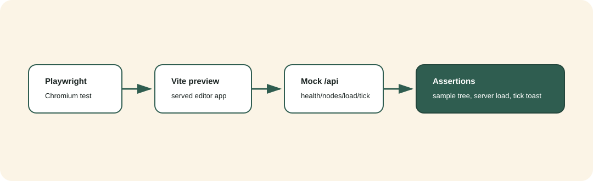
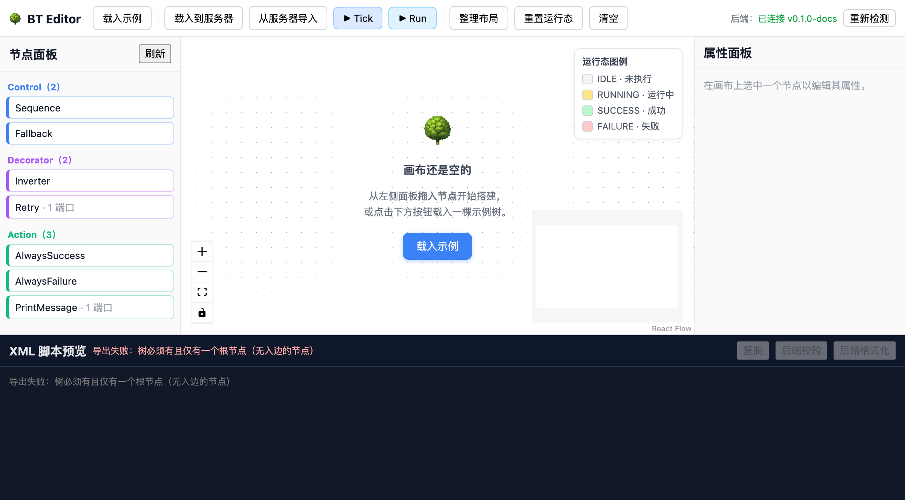
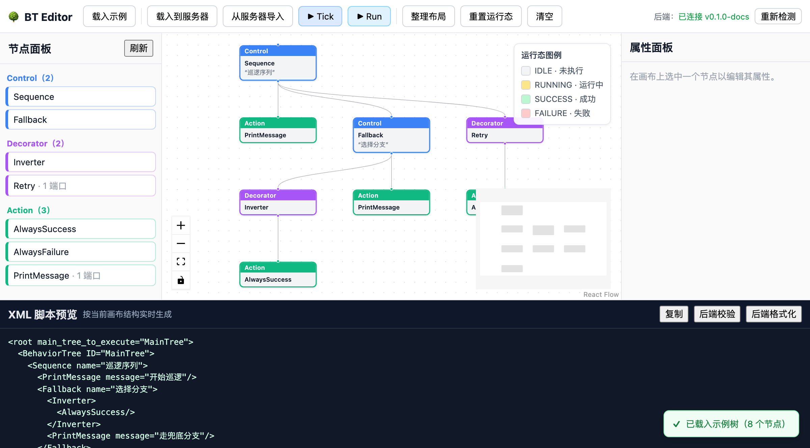
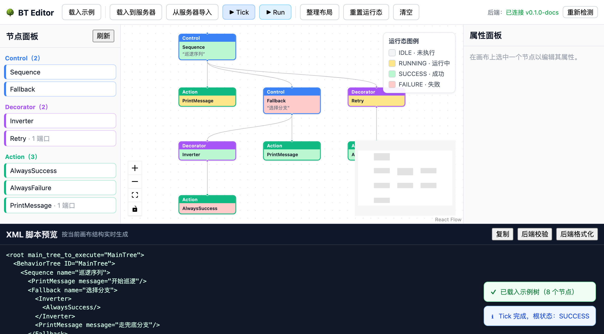

编辑器与 Playwright
===================

编辑器结构
----------

``bt_editor`` 使用 React + TypeScript + React Flow。开发期 Vite 把 ``/api`` 代理到 ``bt_server``，当前 Playwright smoke 会 mock 页面流程实际用到的 ``/api/health``、``/api/nodes``、``/api/tree/load``、``/api/tree/tick``、``/api/tree/run``、``/api/tree/validate``、``/api/tree/format`` 和 ``/api/tree/export``，因此 E2E 不依赖 C++ 后端在线。真实后端协议由 ``scripts/smoke_server.sh`` 单独覆盖。

已有 E2E 覆盖
-------------

``bt_editor/e2e/editor.spec.ts`` 覆盖：

* 页面加载和后端健康状态显示。
* 节点面板从 ``/api/nodes`` 获取 manifest。
* 点击 ``载入示例`` 后画布显示示例树。
* 点击 ``载入到服务器`` 后向 ``/api/tree/load`` 发起请求。
* 点击 ``Tick`` 后向 ``/api/tree/tick`` 发起请求并显示状态 toast。
* XML 脚本预览实时显示当前画布导出的 XML。
* 点击 ``后端校验`` 和 ``后端格式化`` 分别调用 ``/api/tree/validate`` 与 ``/api/tree/format``。
* 点击 ``Run`` 后向 ``/api/tree/run`` 发起请求并显示最终状态摘要。
* 点击 ``整理布局`` 后对当前树执行层级布局。
* 从节点面板拖拽节点到画布。
* 通过 React Flow handle 连线并检查导出 XML 结构。
* 编辑实例名与端口值后检查 XML 预览。
* Tick 后按 DFS 前序映射节点状态，并断言运行态上色。
* 从服务器导入 XML 后检查结构一致性。

运行：

.. code-block:: bash

   cd bt_editor
   npm run test:e2e

截图资料
--------

以下截图来自 ``docs/blog/screenshots``，用于说明编辑器当前形态。

截图可用 Playwright 重新生成：

.. code-block:: bash

   cd bt_editor
   npm run screenshots

``npm run screenshots`` 会使用固定 viewport 与 mock 后端，把 ``01_editor_loaded.png``、``02_sample_tree.png``、``03_tick_colored.png`` 和 ``04_tick_highlight_fixed.png`` 写入 ``docs/blog/screenshots``。它不属于默认 CI 流程，避免普通测试修改文档图片。

剩余测试缺口
------------

Playwright 覆盖浏览器闭环，Vitest 已覆盖纯逻辑：

* XML 导入导出 round-trip。
* DFS 前序 id 对齐。
* 连线规则。
* 导入布局和整理布局算法。
* 端口控件类型推断。

剩余缺口是 live backend browser integration：当前浏览器测试用 mock 端点保证 UI 行为稳定，真实后端协议由 ``scripts/smoke_server.sh`` 覆盖。
