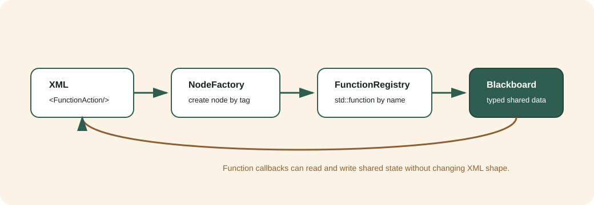

函数手册
========

这份手册对应源码里的三条主线：

* ``bt_core``：行为树执行、节点工厂、端口和黑板。
* ``bt_nodes``：常用控制/装饰/动作/条件/数据节点，以及函数注册表。
* ``bt_ros2``：ROS2 topic 数据录入、条件判断和命令发布。

核心模型
--------

行为树执行时只认四个概念：

.. list-table::
   :header-rows: 1
   :widths: 20 30 50

   * - 概念
     - 代码入口
     - 作用
   * - 工厂
     - ``bt_core::NodeFactory``
     - 注册类型名，按 XML 标签创建节点。
   * - 黑板
     - ``bt_core::Blackboard``
     - 节点之间共享类型安全数据。
   * - 端口
     - ``providedPorts()``
     - 描述节点输入输出，供 XML、编辑器和运行期绑定。
   * - 函数注册表
     - ``bt_nodes::FunctionRegistry``
     - 把普通 C++ 函数以名字暴露给 XML 节点。

XML 端口有两种语义：

.. code-block:: xml

   <PrintMessage message="hello"/>
   <PrintMessage message="{greeting}"/>

第一行是字面量，只保存在当前节点的 ``port_values``；第二行表示从黑板 key
``greeting`` 读取。严格 XML 会拒绝未声明属性，因此除保留的 ``name`` 外，每个可在
XML 配置的属性都必须由节点的 ``providedPorts()`` 声明。

常用节点目录
------------

.. list-table::
   :header-rows: 1
   :widths: 28 20 52

   * - 节点
     - 类型
     - 用途
   * - ``Sequence``
     - Control
     - 子节点从左到右全部成功才成功。
   * - ``Fallback``
     - Control
     - 子节点从左到右遇到第一个成功即成功。
   * - ``Parallel``
     - Control
     - 逻辑并行 tick 子节点，按阈值判定。
   * - ``Retry`` / ``Repeat``
     - Decorator
     - 重试失败或重复成功。
   * - ``ForceSuccess`` / ``ForceFailure``
     - Decorator
     - 强制改写子节点终态。
   * - ``SetBlackboard`` / ``SetBool``
     - Action
     - 写黑板数据。
   * - ``Counter``
     - Action
     - 递增计数并写回黑板。
   * - ``ClearBlackboard``
     - Action
     - 删除黑板 key（幂等 ``SUCCESS``，空 key ``FAILURE``）。
   * - ``CompareBlackboard`` / ``CheckBool``
     - Condition
     - 从黑板读取数据并判断。
   * - ``ScalarThreshold``
     - Condition
     - 读黑板数值与阈值按 ``op`` 比较，聚焦数值门控。
   * - ``BlackboardExists``
     - Condition
     - 判断黑板是否存在某 key。
   * - ``CooldownCondition``
     - Condition
     - 做频率限制，适合命令节流。
   * - ``Delay``
     - Action（异步）
     - 到时前持续 ``RUNNING``，演示异步动作语义。
   * - ``WaitUntilElapsed``
     - Condition
     - 自首拍起单调到时后放行。
   * - ``LogEvent``
     - Action
     - 分级诊断日志埋点，恒 ``SUCCESS``。
   * - ``FunctionAction`` / ``FunctionCondition``
     - Action / Condition
     - 按函数名调用 C++ 函数注册表。

内置节点共 25 个，完整端口表与失败语义见 :doc:`node_catalog`。

用单例函数注册表接业务函数
--------------------------

适用场景：你已经有一批常用 C++ 函数，不想为每个函数都写一个节点类。把函数注册到单例表，XML 只引用函数名。

.. code-block:: cpp

   #include "function/function_registry.hpp"

   bt_nodes::FunctionRegistry::instance().registerAction(
       "robot.recharge.command",
        {
         ctx.blackboard->set<std::string>(ctx.output_key, "start_recharge");
         return bt_core::NodeStatus::SUCCESS;
       });

对应 XML：

.. code-block:: xml

   <FunctionAction function="robot.recharge.command"
                   input="main_dock"
                   output_key="last_command"/>

端口与失败语义：

.. list-table::
   :header-rows: 1
   :widths: 22 18 20 40

   * - 端口
     - 方向
     - 默认
     - 说明
   * - ``function``
     - input
     - ``""``
     - 注册函数名；空字符串直接 ``FAILURE``。
   * - ``input``
     - input
     - ``""``
     - 可选字符串输入，复杂输入建议从 ``ctx.blackboard`` 读。
   * - ``output_key``
     - input
     - ``""``
     - 可选输出 key，业务函数写入前应判断是否为空。

同名 ``registerAction`` 会覆盖旧回调。未知动作函数返回 ``FAILURE``，不会抛异常。

更稳妥的写法：

.. code-block:: cpp

   bt_nodes::FunctionRegistry::instance().registerAction(
       "robot.recharge.command",
        {
         if (!ctx.output_key.empty()) {
           ctx.blackboard->set<std::string>(ctx.output_key, "start_recharge");
         }
         return bt_core::NodeStatus::SUCCESS;
       });

条件函数：

.. code-block:: cpp

   bt_nodes::FunctionRegistry::instance().registerCondition(
       "robot.battery.low",
        {
         return ctx.blackboard->get<double>("battery_level").value_or(1.0) < 0.20;
       });

对应 XML：

.. code-block:: xml

   <FunctionCondition function="robot.battery.low"/>

``FunctionCondition`` 端口同 ``FunctionAction``。空 ``function`` 或未知条件函数都会返回 ``FAILURE``；注册表内部条件回调返回 ``false`` 时也映射为 ``FAILURE``。

这个设计组合了三件事：

* 单例：``FunctionRegistry::instance()`` 统一保存函数引用。
* 工厂：``FunctionAction`` 和 ``FunctionCondition`` 仍由 ``NodeFactory`` 创建。
* 函数引用：注册表保存 ``std::function``，XML 通过函数名解耦实现。

三模式协作：完整回充示例
------------------------

``examples/03_function_registry_recharge.cpp``（可执行 ``example_function_recharge``）把上面三件事串成一个可运行的回充闭环，直接回答“从外部拿到电量数据后怎么通过调用完成回充”。它用普通结构体模拟 ``sensor_msgs/BatteryState``，本机无需 ROS2 即可跑通。三模式分工：

.. list-table::
   :header-rows: 1
   :widths: 24 30 46

   * - 模式
     - 代码落点
     - 负责什么
   * - 单例
     - ``FunctionRegistry::instance()``
     - 全局唯一注册表，启动时登记业务函数，处处按名取用。
   * - 工厂
     - ``NodeFactory``
     - 按 XML 标签创建 ``FunctionAction`` / ``FunctionCondition`` 节点。
   * - 生成器引用函数
     - 注册的 lambda / 普通函数
     - “读电量、判低电、发命令、通知完成”写成函数，XML 只引用函数名。

真实运行输出（场景 A 电量充足不回充，场景 B 低电触发闭环）：

.. code-block:: text

   已注册业务函数: 3 个动作, 1 个条件
   === 场景 A：电量 80%（充足） ===
     [readBattery] ... 读到电量=80%
   根结果: SUCCESS | recharge_done=false
   === 场景 B：电量 12%（低电量，触发回充） ===
     [readBattery] ... 读到电量=12%
     [isLowBattery] ... 低电量, 需要回充
     [sendRechargeCommand] ... start_recharge:main_dock
     [notifyDone] ... task_done:recharge
   根结果: SUCCESS | recharge_done=true

完整的三模式讲解、数据流图、逐节点闭环表和“从示例到真实 ROS2”的迁移路径见 :doc:`singleton_factory_function`。

写一个专用节点
--------------

当业务稳定后，可以沉淀成专用节点，编辑器也能看到更明确的端口说明。

.. code-block:: cpp

   class RequestDockNode : public bt_core::ActionNode {
    public:
     using bt_core::ActionNode::ActionNode;

     static bt_core::PortsList providedPorts() {
       return bt_core::makePorts(
           bt_core::InputPort<std::string>("target", "main_dock", "目标充电桩"));
     }

     bt_core::NodeStatus tick() override {
       auto target = getInput<std::string>("target").value_or("main_dock");
       blackboard()->set<std::string>("last_dock_target", target);
       return bt_core::NodeStatus::SUCCESS;
     }
   };

注册：

.. code-block:: cpp

   factory.registerNodeType<RequestDockNode>("RequestDock");

XML：

.. code-block:: xml

   <RequestDock target="main_dock"/>

开发建议
--------

* 临时业务逻辑先用 ``FunctionAction`` / ``FunctionCondition``。
* 高频稳定逻辑沉淀成专用节点类。
* 跨节点数据统一走黑板，不要用全局变量传状态。
* ROS2 订阅节点复用 ``topic``、``timeout_ms``、``qos_depth``、``qos_profile``；发布节点还可用 ``subscriber_wait_timeout_ms`` 等观察者。
* 需要“发一次、跨 tick 等结果、超时、halt/retry”的动作参考 :doc:`ros2_recharge_tutorial` 中的 ``RechargeTask``，不要用 cooldown 拼接两个瞬时节点。
* 每个新节点至少补一个非 ROS 单测；ROS2 Humble 按 :doc:`ros2_recharge_tutorial` 验证真实消息闭环。Jazzy 状态：unverified: ROS 2 Jazzy is not installed on this machine.
