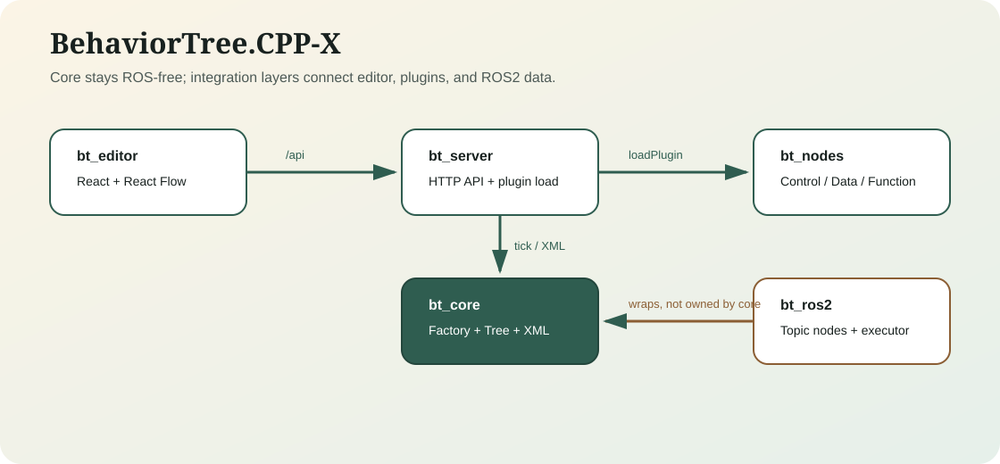

BehaviorTree.CPP-X 文档
========================

BehaviorTree.CPP-X 是一个插件化、ROS 解耦的 C++17 行为树框架。它把核心执行、节点插件、HTTP 后端、React 编辑器和 ROS2 wrapper 分开，让行为树既能独立运行，也能接入机器人系统。

这套 Sphinx 文档面向日常开发：先说明怎么启动和验证，再说明怎么写节点、怎么用函数注册表复用业务逻辑、怎么把 ROS2 topic 数据接入黑板并触发回充动作。

推荐路径
--------

1. 先跑 :doc:`quickstart`，确认本机 C++、前端、server smoke、Playwright 都能过。
2. 再读 :doc:`function_manual`，理解工厂、端口、黑板、函数注册表和常用节点。
3. 用 :doc:`singleton_factory_function` 打通“单例 + 工厂 + 生成器引用函数”三模式与回充闭环。
4. 接着按 :doc:`ros2_recharge_tutorial` 改出自己的 ROS2 数据流节点。
5. 用 :doc:`tree_script_style` 规范 XML 命名、黑板 key、SubTree 和 formatter。
6. 最后用 :doc:`developer_workflow` 固化开发、测试和文档构建流程。

.. toctree::
   :maxdepth: 2
   :caption: 使用手册

   quickstart
   function_manual
   singleton_factory_function
   tree_script_style
   ros2_recharge_tutorial
   editor_playwright
   developer_workflow

.. toctree::
   :maxdepth: 2
   :caption: 设计与参考

   architecture
   node_catalog
   api_reference
   testing_matrix
   commercial_release
