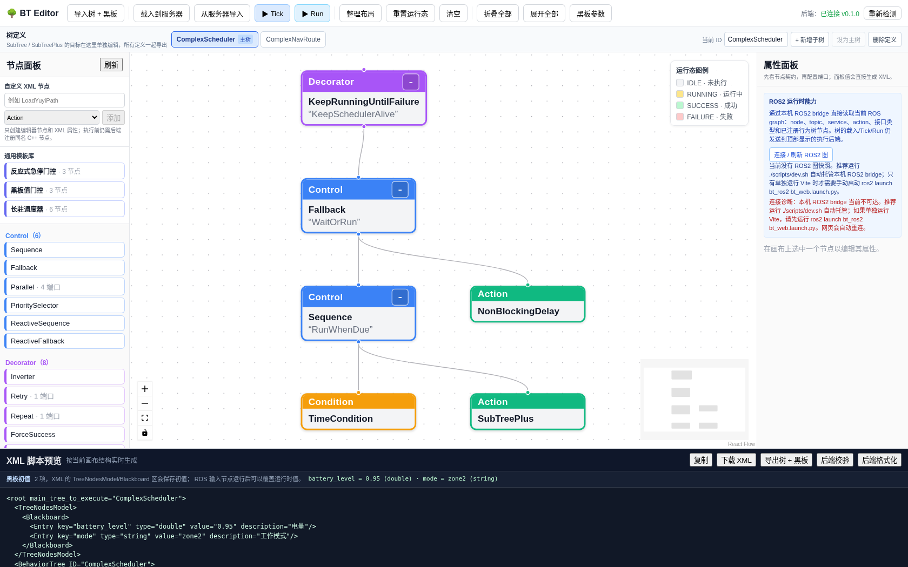
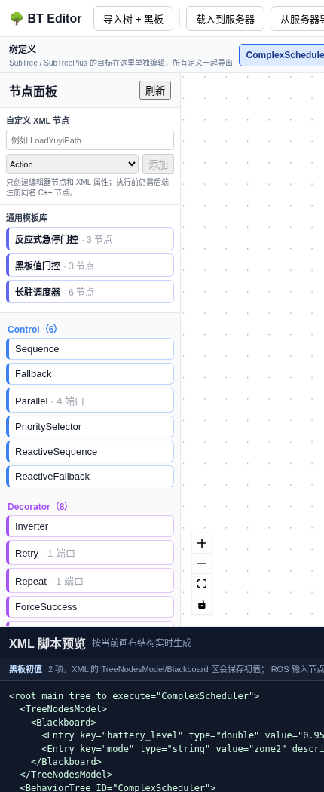
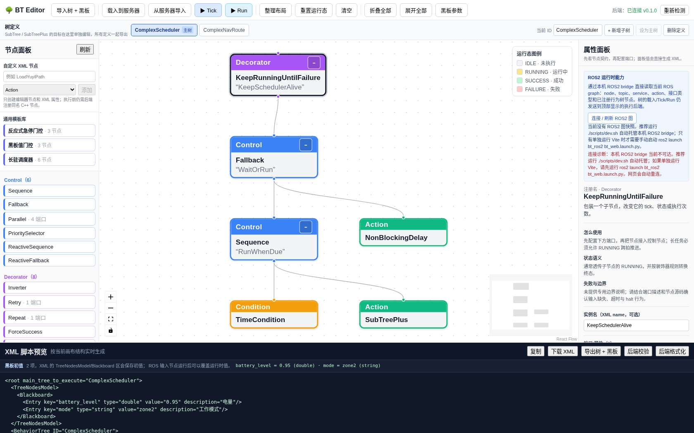
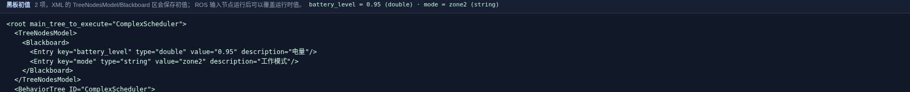
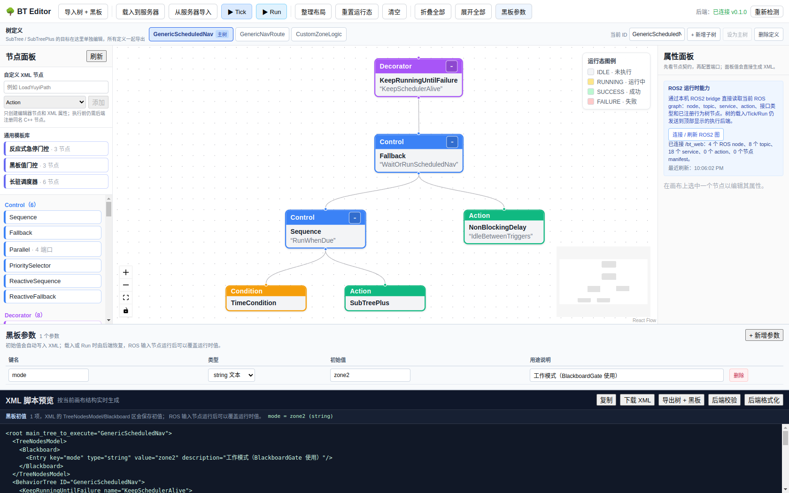
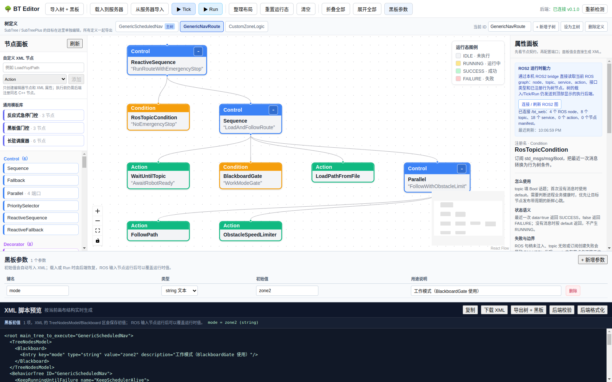

ROS2 能力与 5173 编辑器
=======================

这套系统把编辑器的树 API 与 ROS2 运行时发现拆成两个本机服务：

* ``bt_server``（默认 ``http://127.0.0.1:8080``）负责 XML 校验、载入、Tick 和 Run。
* ``bt_web``（默认 ``http://127.0.0.1:8088``）通过 ``rclpy`` 加入 DDS，直接读取实时 ROS graph。

浏览器本身不能加入 DDS，因此仍需要一个本机 HTTP bridge，但用户不必手动维护它：
``./scripts/dev.sh`` 会自动探测 ``rclpy``，优先启动已安装的 ``bt_ros2``，否则直接运行仓库
中的 ``bt_web.py``。编辑器属性面板看到“当前没有 ROS2 图快照”通常表示 bridge 尚未启动、
ROS2 包和 Python 环境不可用，或 ``ROS_DOMAIN_ID`` 不一致。普通后端仍可用于控制节点、黑板和
XML 设计，所有 ROS 端口也仍可手填。

启动顺序
--------

在仓库根目录显式构建 ``bt_ros2``。不要直接使用不带 ``--base-paths`` 的
``colcon build --packages-select bt_ros2``，因为 colcon 会把顶层 CMake 项目识别成另一个包，
并停止继续发现内部的 ROS 包。

.. code-block:: bash

   source /opt/ros/humble/setup.bash
   colcon --log-base log_ros2 build \
     --base-paths "$PWD/bt_ros2" \
     --build-base build_ros2 \
     --install-base install_ros2 \
     --packages-select bt_ros2
   source install_ros2/setup.bash
   ros2 pkg prefix bt_ros2

启动执行器：

.. code-block:: bash

   source /opt/ros/humble/setup.bash
   source install_ros2/setup.bash
   ros2 launch bt_ros2 bt_executor.launch.py \
     tree_file:=$(ros2 pkg prefix bt_ros2)/share/bt_ros2/trees/recharge.xml

单独调试时可在另一个终端启动只读网关：

.. code-block:: bash

   source /opt/ros/humble/setup.bash
   source install_ros2/setup.bash
   ros2 launch bt_ros2 bt_web.launch.py http_port:=8088

日常使用推荐从仓库根目录运行 ``./scripts/dev.sh``。它会自动托管 8088 bridge，并自动 source
仓库已有的 ``install_ros2/setup.bash`` overlay；只有单独
运行 Vite 或调试 bridge 时才需要上面的手动命令。若没有其他 ROS2 节点在相同
``ROS_DOMAIN_ID`` 中运行，bridge 在线但 graph 为空属于正常结果。

``dev.sh`` 其余部分保持 Bash 严格 ``nounset``，但 source ROS/colcon setup 时会临时关闭该选项，
以兼容它们使用的可选变量 ``AMENT_TRACE_SETUP_FILES`` 和 ``COLCON_TRACE``。用户不需要手动
执行 ``set +u``。

验证能力消息：

.. code-block:: bash

   curl http://127.0.0.1:8088/api/v1/bt/capabilities | jq

``available=true`` 且 ``capabilities`` 非空时，``bt_web`` 已完成一次 graph 读取。查看
``ros_nodes``、``topics``、``services`` 和 ``actions`` 可确认当前 DDS 资源；``manifests``
来自在线 executor 的节点工厂目录，没有 executor 时可以为空。

快照只代表当前 graph：如果 executor 节点消失，bridge 下一次刷新会清掉旧的 ``manifests``，
不会把已卸载的 Yuyi/ROS 插件继续当成可执行节点。ROS Action 的
``send_goal/get_result/cancel_goal`` 内部 service 仅用于推导 ``actions``，不会作为普通
``services`` 候选显示。

在编辑器中配置
----------------

运行 ``./scripts/dev.sh`` 后打开 ``http://127.0.0.1:5173``。脚本会同时托管 ROS2 graph bridge；
编辑器固定通过
``/ros-api/api/v1/bt/capabilities`` 代理本机 8088，右侧“ROS2 运行时能力”区域提供：

* 首次打开自动连接；bridge 离线时每五秒重试，成功后每三秒刷新；
* “连接 / 刷新 ROS2 图”按钮、最近刷新时间以及 node/topic/service/action/manifest 统计；
* bridge 不可达、graph 为空和 domain 不一致的明确诊断。

界面不提供可编辑 URL。部署到其他主机时由运维配置 Vite 的 ``BT_ROS_WEB_URL``，而不是把
基础设施地址写进树或浏览器草稿。稍后启动 ``bt_web`` 时无需重载页面；所有动态候选仍允许
手工修改，因为 ROS graph 会变化。

如果只想启动普通编辑器，可运行 ``BT_ROS_WEB_MODE=off ./scripts/dev.sh``；如果希望 ROS bridge
不可用时直接让脚本失败，可运行 ``BT_ROS_WEB_MODE=on ./scripts/dev.sh``。

行为树使用示意
--------------

从服务器导入一棵已注册的树后，编辑器按三类面板工作：左侧**节点面板**负责从模板库或
Control/Decorator/Action/Condition 分类中拖入节点，中间**画布**负责连线、缩放与编排，
右侧**属性面板**在选中节点时给出注册名、端口与失败条件说明，底部**XML 脚本预览**实时
反映画布对应的 XML、黑板初值与运行期节点绑定。

要点：

* 画布允许把**多个行为树**放在同一工作区（顶部 ``ComplexScheduler | ComplexNavRoute``
  标签），主调度与子路线分离，通过 ``SubTreePlus`` 引用。
* 属性面板来自节点 ``manifest``，因此 ROS2 端口候选、状态语义与示例 XML 都随当前
  executor 动态更新；未注册的 Yuyi 节点用「自定义 XML 节点」声明端口。
* 底部 ``导出树 + 黑板`` 按钮打包完整配置（XML + 黑板初值 + 多树定义 + 端口契约），
  跨机器迁移时一次恢复。

动态候选与节点用法
------------------

候选来源由节点 manifest 的 ``editor_hint`` 决定，不按端口名猜测，也不包含 Yuyi 业务白名单：

* ``ros_node`` / ``ros_topic`` / ``ros_service`` / ``ros_action`` 对应固定资源类型；
* ``ros_graph_entity`` 根据同一节点的 ``entity_type`` 在四类资源间切换；
* 旧 executor 快照没有 ``services`` / ``actions`` 时，网关和编辑器补空数组，不返回 500。

默认 ``RosGraphCondition`` 可以检查资源是否存在：

.. code-block:: xml

   <RosGraphCondition entity_type="node" entity_name="/planner"/>
   <RosGraphCondition entity_type="service" entity_name="/planner/reset"/>
   <RosGraphCondition entity_type="action" entity_name="/navigate_to_pose"/>

存在返回 ``SUCCESS``，不存在返回 ``FAILURE``；反向条件使用 ``Inverter``。DDS graph 发现
不是健康检查，生产故障检测仍应优先使用带 ``timeout_ms`` 的周期心跳 topic。

Yuyi 常见的无参数命令和布尔开关可直接使用两个非阻塞 service 节点：

.. code-block:: xml

   <CallTriggerService service_name="/sweeper/up/lower"
                       timeout_sec="2.0"
                       message="{lower_response}"/>
   <CallSetBoolService service_name="/sweeper/up/enable"
                       data="true"
                       timeout_sec="2.0"
                       message="{enable_response}"/>

它们等待 service 或响应时返回 ``RUNNING``，响应 ``success`` 决定终态，``message`` 写入黑板；
超时或 halt 会清理 pending request。其他 service/action 消息必须用编译期类型实现插件节点，
但同样可以通过 manifest hint 获得动态名称候选。

对于尚未注册到当前 executor 的 Yuyi 节点，选中“自定义 XML 节点”后可在属性面板声明
typed 端口。例如 ``LoadYuyiPath`` 可以声明 ``path_file``（输入、``string``）和 ``path``
（输出、项目路径类型），再把输出绑定为 ``{route_path}``。这会改变编辑器控件、黑板提示和
配置包中的 ``editor_manifests``，但不会伪造 ROS2 执行能力；真正插件仍必须用同名
``providedPorts()`` 注册端口并实现 ROS 句柄、异步状态、超时和 ``halt()``。

原始 XML 保持标准执行格式，只保存节点属性和 ``TreeNodesModel/Blackboard``；跨机器迁移时
使用“导出树 + 黑板”配置包即可同时恢复 XML、黑板初值、多树定义和自定义端口契约。若当前
executor 已发布同名 runtime manifest，运行时 manifest 优先于包内旧的编辑器声明。

如果 ``/api/nodes`` 暂时不可达，节点面板不会被清空，而是进入“仅设计”降级模式：
``Sequence``、``Fallback``、``Parallel``、常用装饰器以及 ``SubTree``/``SubTreePlus`` 仍可
拖入画布，自定义 XML 节点也仍可手动添加。此时只能下载/复制 XML；载入、Tick、Run 仍要等
树后端恢复，运行期端口和节点说明以之后返回的 runtime manifest 为准。

设计边界
--------

能力快照只描述“当前运行时能看到什么”和“executor 注册了什么”，不会凭接口名称自动生成
任意消息类型的 C++ 行为树节点。发现 ``custom_msgs/msg/Status`` 后，仍需要实现并注册一个
真正的节点，再由 executor 运行。普通 ``bt_server`` 也不能执行依赖 ``rclcpp`` 的节点：

.. code-block:: text

   5173 编辑器
     ├── /api/*       -> 8080 bt_server（编辑/普通节点执行）
     └── /ros-api/*   -> 8088 bt_web（ROS2 能力发现，只读）

包含 ``ReadScalar``、``IsFlagTrue``、``RosTopicAction``、service 动作或自定义 ROS 节点的最终 XML，应由
``BtExecutorNode`` 加载和 Tick。当前 ``bt_web`` 不提供 ``/api/tree/load``、``/api/tree/run``；
要做到单地址的编辑、载入和运行，需要后续实现 ROS-aware editor backend，并复用同一套
``/api`` 契约，而不是把只读网关冒充成执行后端。

Yuyi 大树当前覆盖范围
----------------------

编辑器可以直接导入并继续设计用户给出的多树 XML，但“可显示”和“可执行”必须分开判断：

* 已原生支持结构：``Sequence``、``Fallback``、``Parallel``、``Inverter``、
  ``ForceSuccess``、多 ``BehaviorTree``、``SubTreePlus`` 映射和 XML 黑板初值。
* 已提供通用 ROS2 节点：``RosGraphCondition``、``RosTopicCondition``、
  ``RosTopicAction``、``ReadScalar``、``ReadBattery``、``IsFlagTrue``、
  ``CallTriggerService`` 和 ``CallSetBoolService``。
* ``LoadYuyiPath``、``FollowPath``、``ObstacleSpeedLimiter``、
  ``DetectCurrentMapZone``、``RunOnZoneTransition``、``TimeCondition``、
  ``KeepRunningUntilFailure``、``NonBlockingDelay`` 和
  ``CleanupWorkToolsOnHalt`` 等业务标签仍需 Yuyi ROS2 插件实现并注册。

未知节点可通过“自定义 XML 节点”选择 Control/Decorator/Action/Condition 并添加任意 XML
属性，前端不会写死 topic、service 或 Yuyi 字段。该类别只决定画布连线约束；真正的端口、
``RUNNING``/超时/``halt()`` 语义和执行能力必须由 C++ manifest 与注册类型提供。

故障排查
--------

* ``HTTP 500 @ /ros-api/...``：Vite 代理连不到 8088；优先重新运行 ``./scripts/dev.sh``，它会
  自动托管 bridge。只有单独运行 Vite 时才手动启动 ``bt_web``，并检查端口和进程日志。
* ``Package not found: bt_ros2``：只 source 了 ``/opt/ros/humble``，没有 source 仓库 overlay。
  执行 ``source install_ros2/setup.bash``，或者从仓库根目录重新运行 ``./scripts/dev.sh``。
* bridge 启动脚本会把完整日志写入 ``/tmp/bt_ros_web.log``，也可通过
  ``BT_ROS_WEB_LOG_FILE=/path/to/bridge.log`` 指定。日志中的 ``Operation not permitted`` 通常
  表示运行环境禁止 DDS/HTTP socket，不是 ROS graph 为空。
* ``available=false``：bridge 尚未完成第一次 graph 读取；若持续出现，检查 ``bt_web`` 日志。
* 有 topic/service 但没有预期 ROS 节点：能力快照来自另一个 domain 或 executor，检查两个终端的环境变量。
* 候选存在但载入失败：发现能力和执行后端不是同一个进程；把 XML 交给 ROS2 executor，而不是
  普通 ``bt_server``。

``bt_web`` 的结构观察器与 C++ 执行器使用同一套子树展开顺序；``SubTreePlus`` 会按目标
``BehaviorTree`` 展开，Yuyi 的 ``RunOnZoneTransition`` 等未知标签则按子节点数量保留为
Control/Decorator 结构，而不会被错误压成不可展开的叶子。它只用于显示，不替代执行器的
端口和状态契约校验。

为什么 ROS graph 必须经过 bt_web
--------------------------------

常见疑问：为什么编辑器不直接读 ROS graph，还要多一个 ``bt_web`` 进程？

这是**刻意的架构约束**，不是实现偷懒：

* ``bt_server`` 是纯 C++ / cpp-httplib 进程，**完全不链接 rclcpp**。可用
  ``ldd build/bin/bt_server | grep -c rclcpp`` 验证，结果为 ``0``。它不知道 ROS 是什么，
  因此 ``GET /api/v1/bt/capabilities`` 硬编码返回 ``{"available":false,"capabilities":null}``，
  宁可明确降级也不伪造 node/topic 数据。
* 只有 ``bt_web``（Python + ``rclpy``）能加入 DDS 并调用
  ``get_node_names_and_namespaces()`` / ``get_topic_names_and_types()`` /
  ``get_service_names_and_types()``。
* 浏览器同样不能加入 DDS，所以必须有一个本机 HTTP bridge 把 graph 暴露出来。

这个分工的收益是：**没有安装 ROS2 的机器上，编辑器依然能用**——控制节点、装饰节点、
黑板和 XML 设计全部可用，只是 ROS 端口需要手填而非下拉选择。若把 rclcpp 链进
``bt_server``，就会丧失这一能力。

如果确实需要单进程方案，正确做法是让本身就是 ``rclcpp`` 节点的 ``bt_executor``
额外提供 HTTP 端点，而不是给 ``bt_server`` 增加 ROS 依赖。

graph 数据形状陷阱（已修复）
----------------------------

``rclpy`` 的 ``get_topic_names_and_types()`` 与 ``get_service_names_and_types()`` 返回
**``list[tuple[str, list[str]]]``**，而不是 dict：

.. code-block:: python

   >>> node.get_topic_names_and_types()
   [('/nav3d/current_pose', ['geometry_msgs/msg/PoseStamped']), ...]

``bt_web_core._interface_list()`` 早期只接受 dict，导致真实 graph 的 topic/service 被
静默丢成空列表——编辑器显示 ``N 个 ROS node、0 个 topic、0 个 service``，明显自相矛盾
（有节点却没有任何话题）。现已修复为同时接受 list 与 dict 两种形状，并补充回归测试
``test_builds_capabilities_from_rclpy_list_shape``。

.. note::

   排查此类问题的判据：**ROS node 数量非零但 topic/service 全为 0**。任何活着的 ROS2
   节点至少会暴露 ``/parameter_events``、``/rosout`` 和参数服务，因此全零一定异常。
   反之 ``0 个 action`` 通常是正常的——环境里确实没有 action server 时就该是 0，可用
   ``ros2 action list`` 交叉确认。

上图右侧「ROS2 运行时能力」面板显示 ``已连接 /bt_web：4 个 ROS node、8 个 topic、
18 个 service``。修复前同样的环境只会显示 ``0 个 topic、0 个 service``。

修复带来的直接收益是属性面板的端口候选：

选中任意带 ``editor_hint="ros_topic"`` 的端口（例如 ``RosTopicCondition`` 的 ``topic``、
``WaitUntilTopic`` 的 ``topic``），下拉框会列出当前 graph 中的真实话题，无需手敲名字，
也避免拼写错误导致运行时订阅不到数据。同理 ``ros_service`` 端口会列出真实 service，
``ros_graph_entity`` 端口会列出 node/topic/service/action 全集。

.. note::

   候选只是**设计期辅助**，不改变执行契约。端口仍可手填任意名称——话题尚未启动时
   照样能先写好树，等运行时再由执行器订阅。候选缺失（bridge 未启动）不阻塞任何编辑操作。

自查清单
~~~~~~~~

遇到候选为空时按顺序确认：

#. ``curl -s http://127.0.0.1:8088/api/v1/bt/capabilities | head -c 200`` —— bridge 是否在线且
   ``available=true``。
#. ``ros2 topic list`` 与上一步返回的 ``topics`` 数量是否一致。**不一致且 bridge 报 0** 就是
   数据形状或 domain 问题。
#. ``echo $ROS_DOMAIN_ID`` 在 bridge 终端与目标节点终端是否相同。
#. 编辑器右侧面板点「连接 / 刷新 ROS2 图」，观察是否有「连接诊断」告警。

ROS2 节点都是叶子节点
---------------------

**所有 ROS2 适配节点都不能挂子节点。** 它们的 manifest ``type`` 只会是 ``Action`` 或
``Condition``，即行为树中的叶子；XML 解析器会拒绝给叶子添加子元素。

.. code-block:: xml

   <!-- 错误：Condition 是叶子，解析器报错 -->
   <RosGraphCondition entity_type="node" entity_name="/planner">
     <SubTreePlus ID="WorkRoute"/>
   </RosGraphCondition>

   <!-- 正确：条件与动作作为兄弟节点，由控制节点组织 -->
   <ReactiveSequence>
     <RosGraphCondition entity_type="node" entity_name="/planner"/>
     <SubTreePlus ID="WorkRoute"/>
   </ReactiveSequence>

要"在 ROS 条件之后接另一棵行为树"，用 ``Sequence`` / ``ReactiveSequence`` / ``Fallback``
组织，并用 ``SubTree`` 或 ``SubTreePlus`` 引用目标树。可用如下命令随时确认某节点能否
拥有子节点：

.. code-block:: bash

   curl -s http://127.0.0.1:8080/api/nodes \
     | python3 -c "import sys,json;[print(f\"{x['registration_name']:24} {x['type']}\") for x in json.load(sys.stdin)]"

``Control`` 可有多个子节点，``Decorator`` 恰好一个，``Action`` 与 ``Condition`` 不可有子节点。
