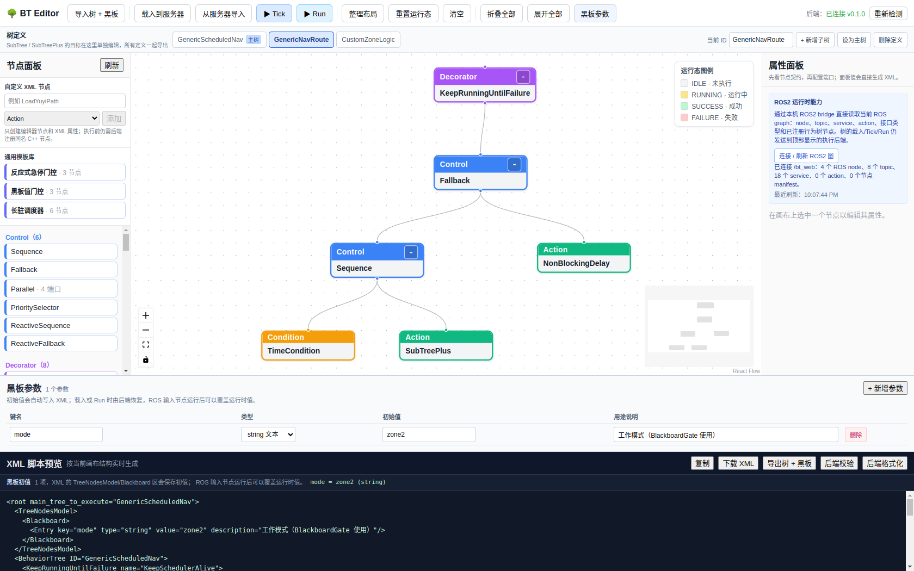

ROS2 插件构建与配置驱动启动
===========================

.. meta::
   :description: bt_ros2 适配节点插件的构建方式、dev.sh 的 ROS2 探测逻辑，以及「一条命令 + 一个配置文件」的启动范式。

.. contents:: 本文目录
   :depth: 3

本页回答三件事：

1. 如何把 ``bt_ros2`` 编成可被 ``bt_server --plugin`` 加载的插件（``libbt_ros2_plugin.so``）。
2. ``scripts/dev.sh`` 如何在检测到 ROS2 时自动构建并加载该插件，让编辑器同时支持
   普通行为树与 ROS2 节点行为树。
3. 如何把启动收敛成「一条命令 + 一个配置文件」。

..

  @author pony
  @date 2026-08-24
  @version v1.0.0
  @last_modified 2026-08-24
  @changelog
  - v1.0.0 (2026-08-24): 新增 ROS2 插件构建与配置驱动启动说明

背景：为什么需要一个插件入口
-----------------------------

``bt_ros2`` 把适配器节点（``ReadBattery`` / ``RosTopicCondition`` / ``CallTriggerService``
等）编成 ``bt_ros2_lib`` 静态库。但 ``bt_server`` 的 ``--plugin`` 需要动态库导出一个
C 链接入口 ``BT_RegisterNodes``（见 ``bt_core/plugin_register.hpp``）才能通过
``dlsym`` 找到并自注册。本仓库为此新增了一个插件入口文件与 CMake 目标：

- ``bt_ros2/src/plugin_registration.cpp`` —— 导出 ``BT_RegisterNodes``，
  调用 ``registerDefaultNodes`` 注册 bt_nodes + ROS topic/data + recharge 各组。
- ``bt_ros2/src/command_subscriber_node.hpp`` —— 新增 ``CommandSubscriber``，
  订阅 ``std_msgs/String`` 写入黑板，供命令切换分支读取。
- ``bt_ros2/src/node_registration.cpp`` —— 把 ``CommandSubscriber`` 加入默认 ROS 数据组。
- ``bt_ros2/CMakeLists.txt`` —— 新增 ``bt_ros2_plugin`` SHARED 目标，并给
  ``bt_ros2_lib`` 打开 ``POSITION_INDEPENDENT_CODE``，使其能被链入共享插件。

如何构建（ROS2 Humble）
-------------------------

要求在 ``/opt/ros/humble`` 或其它已 source 的 distro 下构建：

.. code-block:: bash

   source /opt/ros/humble/setup.bash
   cmake -S . -B build -DBT_BUILD_ROS2=ON -DBT_BUILD_NODES=ON -DBT_BUILD_SERVER=ON
   cmake --build build --target bt_ros2_plugin -j"$(nproc)"

产物为 ``build/lib/libbt_ros2_plugin.so``。验证是否含注册符号：

.. code-block:: bash

   nm -C build/lib/libbt_ros2_lib.a | grep -E "registerRosDataNodes|registerRosTopicNodes"

Rclcpp 的符号可能带 ``-l`` 前缀（弱符号），属正常。

启动 server 并加载插件
------------------------

``bt_server`` 的插件加载有三种来源，按优先级叠加：

#. 显式 ``argv[3..]``：手动传入的插件路径。
#. ``BT_PLUGIN_DIR`` 环境变量：自动扫描目录下所有 ``*.so`` / ``*.dylib``。
#. 若两者都未加载任何插件，则回退到内置示例节点（6 个）。

只要任一来源成功加载了插件，就**不会再注册内置示例节点**，避免 ``libbt_nodes.so``
里的同名节点与示例节点重复注册而整库加载失败。

.. code-block:: bash

   # 显式指定两个插件（普通 + ROS2）
   ./build/bin/bt_server 127.0.0.1 8080 \
     ./build/lib/libbt_nodes.so \
     ./build/lib/libbt_ros2_plugin.so

   # 或把插件放进一个目录，BT_PLUGIN_DIR 自动加载（自研 Yuyi 插件也放这里）
   export BT_PLUGIN_DIR=/tmp/btplug
   ./build/bin/bt_server 127.0.0.1 8080

dev.sh 的 ROS2 探测与自动构建
------------------------------

``scripts/dev.sh`` 在检测到 ROS2（``/opt/ros/<distro>/setup.bash`` 或 ``ros2`` 命令）
时，会：

1. 把 CMake 参数拨成 ``-DBT_BUILD_ROS2=ON``。
2. 构建 ``bt_ros2_plugin``。
3. 以多插件方式启动 ``bt_server``：``"$SERVER_BIN" ... "${PLUGINS[@]}"``。

未检测到 ROS2 时自动降级为普通节点模式，不会因为缺环境卡死。因此下面的命令能同时
覆盖「普通行为树」和「ROS2 节点行为树」两种场景。

配置驱动的启动范式
------------------

**一条命令启动，剩下的全在配置里改。** 复制模板为配置，启动只需：

.. code-block:: bash

   cp .bt-dev.env.example .bt-dev.env
   ./scripts/dev.sh

``dev.sh`` 默认读取仓库根 ``.bt-dev.env``（可用 ``BT_DEV_CONFIG`` 偏移）。配置里的
值优先于脚本默认值，所有键均可被环境变量覆盖。常用键：

``BT_SERVER_HOST``
  bt_server 监听地址。

``BT_SERVER_PORT``
  bt_server 端口（编辑器 /api 代理默认 8080）。

``BT_EDITOR_PORT``
  Vite 前端端口。

``BT_NODES_PLUGIN``
  ``libbt_nodes.so`` 路径（覆盖自动探测）。

``BT_ROS2_PLUGIN``
  ``libbt_ros2_plugin.so`` 路径（覆盖自动探测）。

``BT_PLUGIN_DIR``
  自研插件目录，bt_server 扫描该目录下所有 .so。

``BT_ROS_SETUP_FILE``
  指定 ROS distro 的 setup.bash。

``BT_ROS_WEB_MODE``
  ROS2 图 bridge 开关：auto / on / off。

``BT_ROS_WEB_PORT``
  ROS2 图 bridge 端口。

验证：编辑器同时支持两类树
--------------------------

启动后打开编辑器，``/api/nodes`` 应返回 41 个节点，覆盖：

- 普通控制/装饰/数据节点：``Sequence``、``Fallback``、``Inverter``、``Retry``、
  ``TickRate``、``CompareBlackboard``、``Counter`` 等。
- ROS2 适配节点：``ReadBattery``、``RosTopicCondition``、``RosGraphCondition``、
  ``RosTopicAction``、``CallTriggerService``、``CallSetBoolService``、``CommandSubscriber``。

设计阶段自定义 Yuyi 节点（如 ``LoadYuyiPath`` / ``FollowPath``）仍可能显示未注册，
因为它们属于你自己的 Yuyi 插件，放进 ``BT_PLUGIN_DIR`` 后即自动加载，无需改脚本。

通用节点目录与自定义模型
--------------------------

为满足「通用优先、少量自定义」的诉求，仓库新增了一批**通用节点**，并把机器人专属
语义收敛为最少的自定义插件。

通用核心节点（bt_nodes，任意树可用）
~~~~~~~~~~~~~~~~~~~~~~~~~~~~~~~~~~~~~

``KeepRunningUntilFailure``
  一直执行子节点，直到子节点失败（Decorator）。

``KeepRunningUntilSuccess``
  一直执行子节点，直到子节点成功（Decorator，与上者对称）。

``TimeCondition``
  时间门控：range 每日区间 / interval 周期放行（Timer/Condition）。

``NonBlockingDelay``
  非阻塞延时，未到 msec 返回 RUNNING（Timer/Action）。

``ReactiveSequence``
  反应式顺序：子节点 RUNNING 即从头评估（Control）。

``ReactiveFallback``
  反应式选择：子节点 RUNNING 即从头评估（Control，与上者对称）。

``BlackboardGate``
  黑板键门控：键存在且（可选）值等于 expected 则通过（Condition）。

通用 ROS2 适配节点（bt_ros2，任意机器人可用）
~~~~~~~~~~~~~~~~~~~~~~~~~~~~~~~~~~~~~~~~~~~~~~

``LoadPathFromFile``
  读取轨迹 YAML 并发布为 nav_msgs/Path。

``FollowPath``
  通过 nav2 FollowPath 动作服务器跟随路径。客户端回调由主执行器（``main.cpp`` 的
  ``SingleThreadedExecutor``）单线程派发，节点内不自建 executor、不调用 ``spin_some()``，
  避免第二个执行器与 tick 产生调度争抢（v1.1.0 起）。

``FollowPathTopic``
  纯话题版路径跟随：沿路径发布 cmd_vel，不依赖动作服务器。无动作服务器或追求完全自控、
  复杂设计用本节点（配合 ``ReactiveSequence`` 实现条件抢占）；需要 nav2 精确走线时用
  ``FollowPath``。

``ObstacleSpeedLimiter``
  基于 LaserScan 限速 / 停车，输出 cmd_vel。

``ReadBattery``
  订阅 BatteryState 写入黑板 level。

``RosTopicCondition``
  订阅 Bool 话题作为条件。

``RosGraphCondition``
  检查 node/topic/service/action 在场性。

``CallTriggerService``
  异步调用 std_srvs/Trigger。

``CallSetBoolService``
  异步调用 std_srvs/SetBool。

``CommandSubscriber``
  订阅 String 命令写黑板。

``WaitUntilTopic``
  阻塞等待话题出现新鲜数据：无数据 RUNNING，有数据 SUCCESS。

典型用法示例
~~~~~~~~~~~~~~

**KeepRunningUntilSuccess** — 重试直到成功（对称于 KeepRunningUntilFailure）

.. code-block:: xml

   <KeepRunningUntilSuccess name="RetryUntilDocked">
     <CallTriggerService service_name="/dock" timeout_sec="5.0"/>
   </KeepRunningUntilSuccess>

适用场景：服务调用可能暂时失败（如充电桩未就绪），需反复尝试直到成功。

**ReactiveFallback** — 反应式优先级抢占（对称于 ReactiveSequence）

.. code-block:: xml

   <ReactiveFallback name="PriorityControl">
     <RosTopicCondition topic="/manual_override" default="false"/>
     <RosTopicCondition topic="/battery_critical" default="false"/>
     <SubTreePlus ID="NormalWork"/>
   </ReactiveFallback>

适用场景：高优先级条件（手动接管/低电）可随时打断当前工作，类似"中断向量表"。
每拍重新评估全部条件，一旦高优先级成立立即切换；与普通 Fallback 的区别在于
**即使第三项 RUNNING 也会回头检查前两项**，实现抢占语义。

**WaitUntilTopic** — 阻塞等就绪信号

.. code-block:: xml

   <ReactiveSequence name="WaitAndRun">
     <WaitUntilTopic topic="/robot/ready" timeout_ms="0"/>
     <SubTreePlus ID="Mission"/>
   </ReactiveSequence>

适用场景：等外部系统就绪（如导航模块初始化完成发 ready 信号）再执行任务；
``timeout_ms=0`` 表示只要收到过即通过，不检查数据时效。

**FollowPathTopic** — 纯话题版路径跟随（无 nav2 依赖）

.. code-block:: xml

   <Sequence name="LoadAndFollowSimple">
     <LoadPathFromFile path_file="route.yaml" frame_id="map" topic="/path"/>
     <FollowPathTopic path_topic="/path" cmd_vel_topic="/cmd_vel"
                      lookahead="0.5" linear_speed="0.3" angular_speed="1.0"/>
   </Sequence>

适用场景：轻量机器人、无 nav2 动作服务器或需自定义跟随逻辑时的替代方案；
内置 Pure Pursuit 控制器，输出 ``geometry_msgs/Twist`` 到 ``cmd_vel_topic``。

自定义能力（两层）
~~~~~~~~~~~~~~~~~~~~

1. **编辑器内添加自定义 XML 节点**：左侧「自定义 XML 节点」填注册名 + 类别即可，
   编辑器只生成节点与属性；执行前需后端注册同名 C++ 节点。
2. **BT_PLUGIN_DIR 插件目录**：把自研插件 ``.so`` 放进一个目录，bt_server 自动扫描
   加载注册，无需改脚本。

编辑器「通用模板库」
~~~~~~~~~~~~~~~~~~~~~~

节点面板中部提供一组常用组合，点一次即插入多节点 + 连线，减少逐个添加和连线的成本：

``反应式急停门控``
  ReactiveSequence 根 + RosTopicCondition(``/safety/e_stop``) + AlwaysSuccess 兜底。

``黑板值门控``
  Sequence 根 + BlackboardGate(``key``/``expected``) + AlwaysSuccess 动作。

``长驻调度器``
  KeepRunningUntilFailure 根 + Fallback + Sequence(TimeCondition + SubTreePlus) +
  NonBlockingDelay 空闲分支。

模板只描述注册名、大类、端口默认值和父子关系；实例化仍走与单节点添加相同的
manifest 端口契约，因此模板插入的节点与手动添加完全一致。

上图点击「长驻调度器」后一次插入 6 个节点并自动连好线，XML 预览立即产出合法单根树：

.. code-block:: none

   <KeepRunningUntilFailure>
     <Fallback>
       <Sequence>
         <TimeCondition interval_sec="1800" mode="interval" .../>
         <SubTreePlus ID="WorkRoute"/>
       </Sequence>
       <NonBlockingDelay msec="1000"/>
     </Fallback>
   </KeepRunningUntilFailure>

模板设计约束
^^^^^^^^^^^^

新增模板时必须遵守两条规则，否则导出会报「必须有且仅有一个根节点」：

#. **根必须是 Control 或 Decorator**。叶子节点（Action/Condition）不能作为模板根去挂子节点。
#. **父子关系必须合法**：``Decorator`` 恰好一个子节点，``Control`` 可多个，叶子不可有子节点。

模板定义见 ``bt_editor/src/utils/node_templates.ts``，新增只需追加一条数组项：

.. code-block:: typescript

   {
     id: 'my-template',           // 唯一 id
     label: '我的组合',            // 面板按钮显示名
     description: '悬浮提示文本',
     nodes: [
       { registrationName: 'Sequence', kind: 'Control' },
       { registrationName: 'BlackboardGate', kind: 'Condition',
         portValues: { key: 'mode', expected: 'ready' } },  // 覆盖端口默认值
     ],
     edges: [
       { parentIndex: 0, childIndex: 1 },   // 按 nodes 数组下标连线
     ],
   }

``portValues`` 只覆盖列出的端口，未列出的沿用 manifest 默认值。连线由 ``addEdge()``
生成以补全 ``sourceHandle``/``targetHandle``，与画布手动连线走同一路径。

.. note::

   模板引用的注册名必须存在于运行时 manifest（``GET /api/nodes``），否则该节点会被
   静默跳过——这是刻意行为，避免在缺插件的环境里插入无法执行的节点。若模板插入后
   节点数少于预期，先确认对应插件已加载。

因此「为某台机器人做适配」的正确姿势不是写一套独占插件，而是：

- 优先用通用核心 + 通用 ROS2 节点组合（XML 直接表达）。
- 只有真正的业务语义（如分区、清扫工具启停）才写成插件，放进 ``BT_PLUGIN_DIR``。

示例 .playwright-mcp/generic_scheduled_nav.xml 展示了一个只依赖通用节点、仅把
分区/清扫留作自定义层的调度 + 导航树。验证要点：导入后全节点可编辑，仅 FollowPath
（导航）与 RunOnZoneTransition（分区触发）两项为业务自定义，其余均为通用注册节点。
