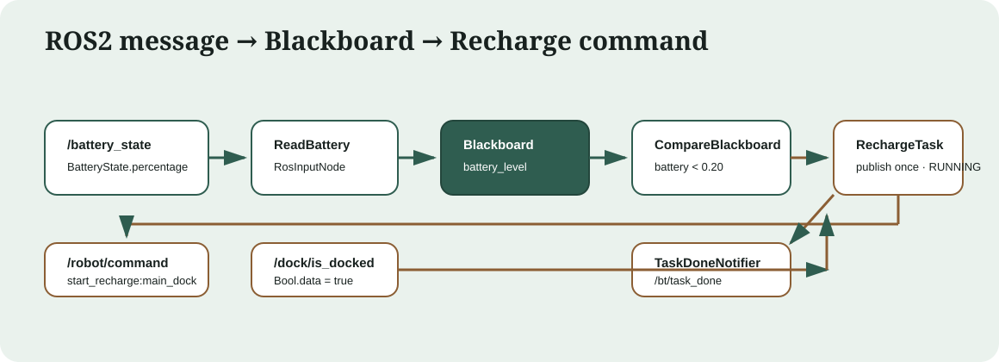

ROS2 回充教程
==============

目标与结果
----------

本教程演示一个可直接运行的完整功能：外部只发布一条电池消息，行为树判断低电量，
``RechargeTask`` 只发布一条回充命令并跨 tick 等待对接；收到一条
``/dock/is_docked=true`` 后，树发布一次完成通知并以 ``SUCCESS`` 结束。

打包树固定为 8 个节点：1 个 ``Fallback``、2 个 ``Sequence``、1 个
``ReadBattery``、2 个 ``CompareBlackboard``、1 个 ``RechargeTask`` 和 1 个
``TaskDoneNotifier``。执行器默认注册 35 种节点。

涉及文件
--------

.. list-table::
   :header-rows: 1
   :widths: 38 62

   * - 文件
     - 作用
   * - ``bt_ros2/include/bt_ros2/ros_subscriber_node.hpp``
     - 可复用的 ROS2 条件/输入订阅基类，统一数据时效与 QoS。
   * - ``bt_ros2/include/bt_ros2/ros_publisher_node.hpp``
     - 可复用的发布基类，支持等待订阅者匹配。
   * - ``bt_ros2/include/bt_ros2/recharge_task.hpp``
     - 七端口回充 Action 的公开契约。
   * - ``bt_ros2/src/recharge_task.cpp``
     - 单次发布、等待、超时、终态锁存和 halt/retry 状态机。
   * - ``bt_ros2/src/node_registration.cpp``
     - 通过单例 catalog、工厂和注册函数引用注册 35 种节点。
   * - ``bt_ros2/src/bt_executor_node.cpp``
     - 建树、周期 tick、根状态、幂等 start/stop service。
   * - ``bt_ros2/trees/recharge.xml``
     - 本教程使用的八节点行为树。
   * - :doc:`testing_matrix`
     - 汇总非 ROS gate 与真实 DDS 验收边界。

消息如何进入黑板
----------------

``ReadBattery`` 继承 ``RosInputNode<sensor_msgs::msg::BatteryState>``。首次 tick
惰性创建订阅；收到新鲜消息后，``onData`` 把 ``percentage`` 写入输出端口：

.. code-block:: cpp

   void onData(const sensor_msgs::msg::BatteryState& msg) override {
     setOutput<double>("level", static_cast<double>(msg.percentage));
   }

XML 用 ``{battery_level}`` 把输出重映射到共享黑板。``sensor_data`` QoS 适合电池
传感器流；字面量参数仍只属于当前节点。

.. code-block:: xml

   <ReadBattery topic="/battery_state"
                timeout_ms="2000"
                qos_profile="sensor_data"
                level="{battery_level}"/>

八节点树
--------

.. literalinclude:: ../bt_ros2/trees/recharge.xml
   :language: xml
   :caption: bt_ros2/trees/recharge.xml

``Fallback`` 的第一个分支在电量大于等于 ``0.20`` 时直接成功。低电量时第二个
``Sequence`` 运行；两个控制节点都会保留正在运行的子节点游标，因此进入
``RechargeTask`` 后不会每拍回到 ``ReadBattery``，一条电池消息足以驱动本轮回充。

RechargeTask 状态机
-------------------

.. list-table:: 七个输入端口
   :header-rows: 1
   :widths: 25 14 20 41

   * - 端口
     - 类型
     - 默认值
     - 契约
   * - ``command_topic``
     - string
     - ``/robot/command``
     - 回充命令 topic；空值是配置错误。
   * - ``dock_topic``
     - string
     - ``/dock/is_docked``
     - 对接状态 topic；空值是配置错误。
   * - ``target``
     - string
     - ``main_dock``
     - 发布 ``start_recharge:<target>``。
   * - ``timeout_ms``
     - int
     - ``30000``
     - 等待对接超时；``<=0`` 禁用超时。
   * - ``command_qos_depth``
     - int
     - ``10``
     - 命令发布队列深度，必须大于 0。
   * - ``dock_qos_depth``
     - int
     - ``10``
     - 对接订阅队列深度，必须大于 0。
   * - ``dock_qos_profile``
     - string
     - ``default``
     - 只接受 ``default`` 或 ``sensor_data``。

状态转换：

* 首拍创建或复用 publisher/subscription，清除旧 dock 状态，发布恰好一条命令，返回 ``RUNNING``。
* 后续 tick 不重发命令；先检查 ``dock=true``，再检查超时，因此同时满足时成功优先。
* ``SUCCESS`` / ``FAILURE`` 锁存到 ``halt()``；终态后的重复 tick 不产生副作用。
* ``halt()`` 复位本次尝试但保留 ROS 端点。父级 ``Retry`` 再次尝试时恰好再发一条命令。

``TaskDoneNotifier`` 使用 ``RosOutputNode`` 的公共
``subscriber_wait_timeout_ms=3000``。首次到达时若 DDS 观察者尚未匹配，它先返回
``RUNNING``；匹配后发布一次。3 秒内仍无观察者则照常发布并完成，监控端缺席不会
永久阻塞业务树。

默认注册与扩展
--------------

``BtExecutorNode`` 调用：

.. code-block:: cpp

   bt_ros2::registerDefaultNodes(factory_);

``NodeRegistrationCatalog::instance()`` 默认保存四个注册函数引用：

* ``registerBtNodes``：25
* ``registerRosTopicNodes``：2
* ``registerRosDataNodes``：4
* ``registerRechargeNodes``：4

合计 35 个注册类型。
项目可在 executor 构造前追加一组专用注册函数：

.. code-block:: cpp

   bt_ros2::NodeRegistrationCatalog::instance().add(registerMyRobotNodes);

``PublishRechargeCommand`` 和 ``IsDocked`` 仍注册用于兼容旧 XML，但新功能应使用完整
``RechargeTask``，避免 cooldown 编排造成重复命令和分散状态。

可复制的 Humble 演示
--------------------

先构建并加载同一工作区：

.. code-block:: bash

   source /opt/ros/humble/setup.bash
   cd ~/bt_ws
   colcon build --packages-select bt_ros2
   source install/setup.bash

终端 1 启动安装后的树。手动 start 便于先接好所有观察者；终态自动停止 tick：

.. code-block:: bash

   TREE_FILE="$(ros2 pkg prefix bt_ros2)/share/bt_ros2/trees/recharge.xml"
   ros2 launch bt_ros2 bt_executor.launch.py \
     tree_file:="$TREE_FILE" \
     tick_rate_hz:=10.0 \
     autostart:=false \
     stop_on_terminal:=true

终端 2、3、4 分别先监听唯一命令、唯一通知和根状态：

.. code-block:: bash

   source /opt/ros/humble/setup.bash
   source ~/bt_ws/install/setup.bash
   ros2 topic echo --once --field data /robot/command std_msgs/msg/String

.. code-block:: bash

   source /opt/ros/humble/setup.bash
   source ~/bt_ws/install/setup.bash
   ros2 topic echo --once --field data --qos-reliability reliable \
     /bt/task_done std_msgs/msg/String

.. code-block:: bash

   source /opt/ros/humble/setup.bash
   source ~/bt_ws/install/setup.bash
   ros2 topic echo --field data /bt_executor/bt_status std_msgs/msg/String

终端 5 开始 tick，并只发布一条电池消息：

.. code-block:: bash

   source /opt/ros/humble/setup.bash
   source ~/bt_ws/install/setup.bash
   ros2 service call /bt_executor/start std_srvs/srv/Trigger '{}'
   ros2 topic pub --once --wait-matching-subscriptions 1 \
     /battery_state sensor_msgs/msg/BatteryState '{percentage: 0.18}'

第一次 start 的精确字段是 ``success=True, message='started'``，运行中再次 start 是
``success=True, message='already running'``。
终端 2 收到 ``start_recharge:main_dock`` 后，只发布一条 dock 消息：

.. code-block:: bash

   source /opt/ros/humble/setup.bash
   source ~/bt_ws/install/setup.bash
   ros2 topic pub --once --wait-matching-subscriptions 1 \
     /dock/is_docked std_msgs/msg/Bool '{data: true}'

随后终端 3 收到 ``task_done:recharge``，根状态最终为 ``SUCCESS``。运行中 stop 返回
``stopped``，已停止时返回 ``already stopped``；stop 总会 halt 树，为下一轮 start 清理
锁存状态。``stop_on_terminal=true`` 已自动停止计时器，此时可显式调用 stop 验证幂等
响应并完成复位：

.. code-block:: bash

   source /opt/ros/humble/setup.bash
   source ~/bt_ws/install/setup.bash
   ros2 service call /bt_executor/stop std_srvs/srv/Trigger '{}'

预期字段是 ``success=True, message='already stopped'``。

验证边界
--------

默认 mock gate：

.. code-block:: bash

   cmake --build build --target test_ros_bases --parallel
   ./build/bin/test_ros_bases

真实 ROS2 Humble 验收使用本页“启动执行器与观察者”和“只发布一次事件”的可复制命令。
验收范围是 35 个注册、8 节点安装树、幂等 start/stop、各一条
battery/command/dock/notifier 和最终 ``SUCCESS``。需要隔离并行 ROS 图时，在各终端设置
同一个未占用的 ``ROS_DOMAIN_ID``。

Jazzy 环境状态：**unverified: ROS 2 Jazzy is not installed on this machine.**
