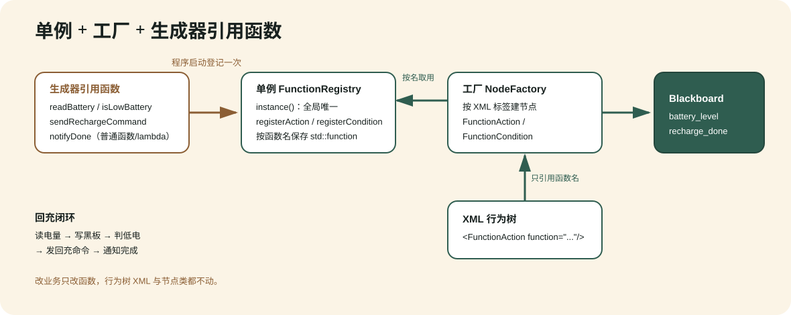

单例 + 工厂 + 生成器引用函数
============================

本页把 ``examples/03_function_registry_recharge.cpp``（可执行 ``example_function_recharge``）讲透，回答一个非常具体的诉求：

    我要做回充：从外部（ROS2 msg 形式）拿到电量数据，然后怎么通过“调用”来完成回充？

示例用三种设计模式协作完成“读电量 → 写黑板 → 判低电 → 发回充命令 → 通知完成”的闭环。它不依赖真实 ROS2：用一个普通结构体 ``BatteryMsg`` 模拟 ``sensor_msgs/BatteryState``，用自由函数 ``pollBatteryFromRos()`` 模拟“从 topic 回调里拿到最新一帧”，因此本机可跑可验。真实项目里只要把这一步换成 :doc:`ros2_recharge_tutorial` 里的 ``ReadBattery``（订阅 ``/battery_state`` 并写黑板），业务函数完全不用改。

三模式各自负责什么
------------------

.. list-table::
   :header-rows: 1
   :widths: 22 30 48

   * - 模式
     - 代码落点
     - 负责什么
   * - 单例 Singleton
     - ``FunctionRegistry::instance()``
     - 全局唯一的业务函数注册表。程序启动时登记一次，任何地方都能按名取用；避免到处传递注册表指针。
   * - 工厂 Factory
     - ``NodeFactory``
     - 按注册名把 XML 标签创建成节点实例。行为树的 XML、编辑器、插件都通过它建树，节点实现与使用解耦。
   * - 生成器引用函数
     - 注册进单例表的 ``lambda`` / 普通函数
     - 把“读电量、判低电、发命令、通知完成”写成普通函数（可捕获状态、可复用），XML 只用函数名引用，不和任何具体节点类耦合。改业务只改函数，不动树。

一句话概括边界：**单例管“函数存在哪”，工厂管“节点怎么造”，生成器函数管“业务做什么”。** 三者通过黑板交换数据。

业务函数：写成普通函数
----------------------

业务逻辑写成 ``FunctionRegistry`` 约定的签名 ``ActionFunction`` / ``ConditionFunction``，通过 ``ctx.blackboard`` 读写共享黑板实现数据流：

.. code-block:: cpp

   // 动作：读电量 → 写黑板 battery_level。等价于 ROS2 的 ReadBattery 节点。
   NodeStatus readBatteryFn(const FunctionContext& ctx) {
     const BatteryMsg msg = pollBatteryFromRos();
     ctx.blackboard->set<double>("battery_level", msg.percentage);
     return NodeStatus::SUCCESS;
   }

   // 条件：电量是否低于 20%（低电量需要回充）。
   bool isLowBatteryFn(const FunctionContext& ctx) {
     const double v = ctx.blackboard->get<double>("battery_level").value_or(1.0);
     return v < 0.20;
   }

   // 动作：同步示例中记录回充命令；不等价于等待 dock 的异步 RechargeTask。
   NodeStatus sendRechargeCommandFn(const FunctionContext& ctx) {
     const std::string target =
         ctx.blackboard->get<std::string>("dock_target").value_or("main_dock");
     ctx.blackboard->set<std::string>("last_command", "start_recharge:" + target);
     return NodeStatus::SUCCESS;
   }

   // 动作：上报任务完成。等价于 ROS2 的 TaskDoneNotifier 节点。
   NodeStatus notifyDoneFn(const FunctionContext& ctx) {
     ctx.blackboard->set<bool>("recharge_done", true);
     return NodeStatus::SUCCESS;
   }

单例：程序启动时登记一次
------------------------

.. code-block:: cpp

   auto& registry = FunctionRegistry::instance();
   registry.registerAction("readBattery", readBatteryFn);
   registry.registerAction("sendRechargeCommand", sendRechargeCommandFn);
   registry.registerAction("notifyDone", notifyDoneFn);
   registry.registerCondition("isLowBattery", isLowBatteryFn);

此后任何 ``FunctionAction`` / ``FunctionCondition`` 节点都能按名取用。``registerAction`` / ``registerCondition`` 遇到空名或空回调会抛 ``std::invalid_argument``；同名注册会覆盖旧回调。

工厂：把标签变成节点
--------------------

.. code-block:: cpp

   NodeFactory factory;
   factory.registerNodeType<bt_nodes::SequenceNode>("Sequence");
   factory.registerNodeType<bt_nodes::FallbackNode>("Fallback");
   factory.registerNodeType<bt_nodes::CompareBlackboardNode>("CompareBlackboard");
   factory.registerNodeType<bt_nodes::FunctionActionNode>("FunctionAction");
   factory.registerNodeType<bt_nodes::FunctionConditionNode>("FunctionCondition");

行为树 XML 就是靠工厂按注册名把标签变成节点实例。

行为树 XML：只出现函数名
------------------------

XML 里没有任何业务类，只有函数名。用 ``Fallback`` 做回充守卫：先走“电量充足”分支，失败（电量低）时落到“回充”分支：

.. code-block:: xml

   <root main_tree_to_execute="RechargeTree">
     <BehaviorTree ID="RechargeTree">
       <Fallback name="battery_guard">
         <Sequence name="battery_ok">
           <FunctionAction name="read_battery_ok" function="readBattery"/>
           <CompareBlackboard name="enough_power"
                              key="battery_level" op="&gt;=" value="0.20"/>
         </Sequence>
         <Sequence name="recharge_flow">
           <FunctionAction    name="read_battery_low"  function="readBattery"/>
           <FunctionCondition name="needs_recharge"    function="isLowBattery"/>
           <FunctionAction    name="send_command"      function="sendRechargeCommand"/>
           <FunctionAction    name="notify_done"       function="notifyDone"/>
         </Sequence>
       </Fallback>
     </BehaviorTree>
   </root>

回充闭环数据流
--------------

一次 tick 里数据如何在“外部世界 → 黑板 → 判断 → 命令”之间流动：

.. list-table::
   :header-rows: 1
   :widths: 8 26 30 36

   * - 步
     - 节点
     - 调用的函数
     - 对黑板的影响
   * - 1
     - ``FunctionAction readBattery``
     - ``readBatteryFn``
     - 从（模拟）``/battery_state`` 读电量，写入 ``battery_level``。
   * - 2
     - ``CompareBlackboard`` / ``FunctionCondition``
     - ``isLowBatteryFn``
     - 读 ``battery_level`` 判断是否 ``< 0.20``。
   * - 3
     - ``FunctionAction sendRechargeCommand``
     - ``sendRechargeCommandFn``
     - 读 ``dock_target``，写 ``last_command = start_recharge:main_dock``。
   * - 4
     - ``FunctionAction notifyDone``
     - ``notifyDoneFn``
     - 写 ``recharge_done = true``。

运行与验证
----------

.. code-block:: bash

   cmake -S . -B build -DBT_BUILD_NODES=ON -DBT_BUILD_TESTS=ON
   cmake --build build --target example_function_recharge
   ./build/bin/example_function_recharge

真实输出（两个场景）：

.. code-block:: text

   已注册业务函数: 3 个动作, 1 个条件
   === 场景 A：电量 80%（充足） ===
     [readBattery] ... 读到电量=80%
   根结果: SUCCESS | recharge_done=false
   === 场景 B：电量 12%（低电量，触发回充） ===
     [readBattery] ... 读到电量=12%
     [isLowBattery] ... 低电量, 需要回充
     [sendRechargeCommand] ... start_recharge:main_dock
     [notifyDone] ... task_done:recharge
   根结果: SUCCESS | recharge_done=true

场景 A 电量充足，``Fallback`` 第一个分支直接成功，不回充；场景 B 电量低，第一分支失败落到回充分支，完成整条闭环并把 ``recharge_done`` 置 ``true``。

从示例到真实 ROS2
-----------------

这个示例用于讲解同步函数注册表；它没有模拟真实回充所需的跨 tick 等待、超时和
halt/retry。接真实 ROS2 时保留黑板判断思路，但把 I/O 边界换成完整节点：

* 把 ``readBattery`` 换成 :doc:`ros2_recharge_tutorial` 里的 ``ReadBattery``（``RosInputNode<BatteryState>``），订阅 ``/battery_state`` 并 ``setOutput`` 到黑板 ``battery_level``。
* 把同步 ``sendRechargeCommand`` 换成 :doc:`ros2_recharge_tutorial` 中的 ``RechargeTask``，由它每次尝试发布一次并等待 dock；完成后使用 ``TaskDoneNotifier``。
* 判断分支可继续用 ``CompareBlackboard`` / ``ScalarThreshold`` / ``FunctionCondition``，因为它们只读黑板 ``battery_level``，与消息类型无关。

这正是“函数引用 + 黑板解耦”的价值：纯判断函数可以跨传输层复用；涉及异步 I/O
生命周期的动作则由专用状态机节点承接，而不是把同步示例原样搬到机器人上。
