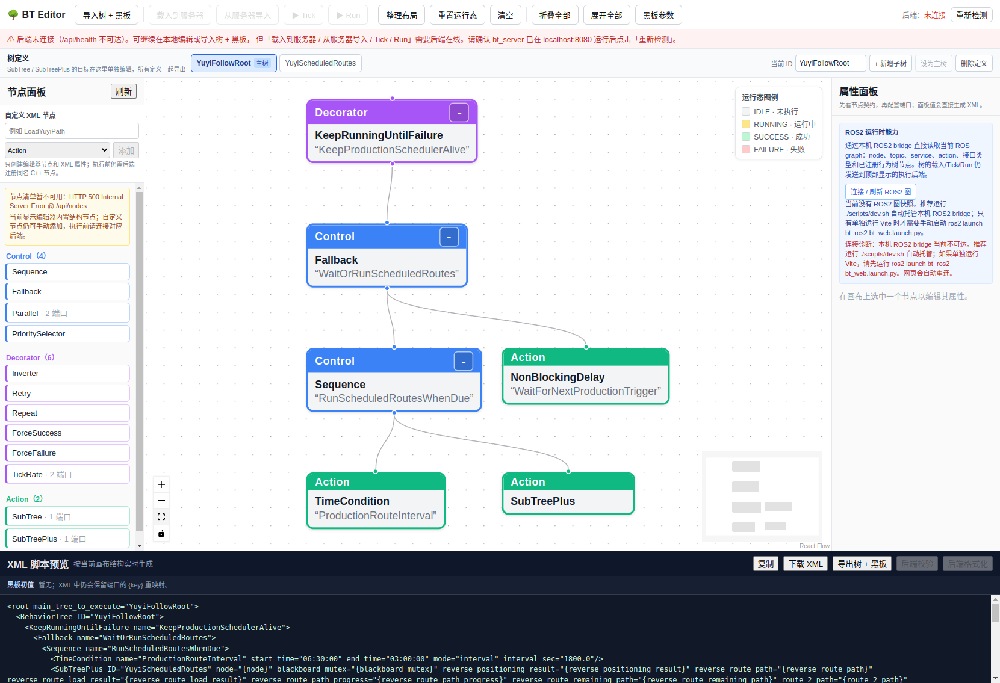
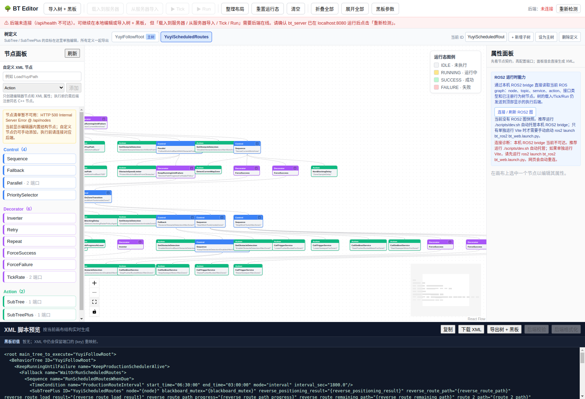
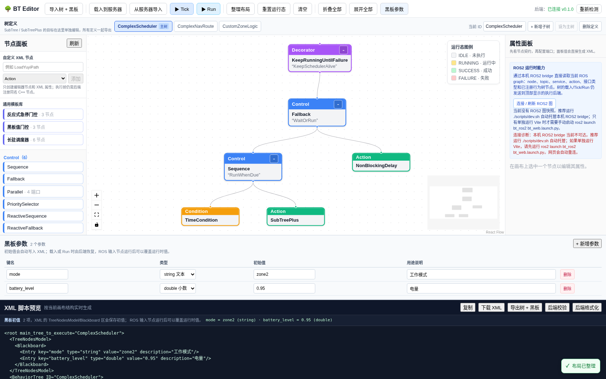

Yuyi 复杂树：ROS2 订阅整合与编辑器优化
========================================

.. meta::
   :description: 以 YuyiFollowRoot 为例，说明把 ROS2 topic/service 接入行为树的做法，以及如何用编辑器优化一棵复杂多子树树。

.. contents:: 本文目录
   :depth: 3

本页把「深度分析」落到可执行的文档上：先拆解一棵真实的 Yuyi 生产调度树，再给出
把 ROS2 订阅接入行为树的三种写法，最后说明如何用可视化编辑器优化这样的复杂树。
所有截图均由 Playwright 在真实编辑器上抓取。

..
   @author pony
   @date 2026-08-24
   @version v1.0.0
   @last_modified 2026-08-24
   @changelog
   - v1.0.0 (2026-08-24): 从 YuyiFollowRoot 抽取，补充 ROS2 订阅整合与编辑器优化方法

读者对象
--------

- 已经跑通 :doc:`quickstart`，会加载一棵多子树树。
- 想给行为树接入电量、雷达、分区、健康心跳等 ROS2 数据，但不确定该放哪个节点。
- 手上有一棵像 Yuyi 一样「主树 + 大子树 + 并行区」的复杂树，想在编辑器里边看边改。

背景：YuyiFollowRoot 是什么
---------------------------

这是一个 ``KeepRunningUntilFailure`` 包住整个生产调度的树：外层用 ``TimeCondition``
按固定间隔 ``interval_sec=1800`` 触发，内层 ``SubTreePlus ID="YuyiScheduledRoutes"``
承载真正的路线执行。它把两个逻辑清晰地解耦：

- 主树 `YuyiFollowRoot`：只负责「到点就跑、跑完等着」的调度决策。
- 子树 `YuyiScheduledRoutes`：负责具体路线，含工作工具升降、障蔽开关和分区策略。

用 Playwright 抓到的真实渲染结构如下，这是编辑器中完整的主树：

子树结构 —— 并行区依赖
~~~~~~~~~~~~~~~~~~~~~~

`YuyiScheduledRoutes` 用 ``Parallel success_threshold=1 failure_threshold=1`` 同时跑两件事：

1. ``FollowRoutes`` —— 串行加载并跟随两条路线（ReverseWork、WorkAndBack）。
2. ``MonitorCurrentWorkArea`` —— 每 1000ms 采样当前分区，按 ``RunOnZoneTransition``
   在进出 ``zone1`` / ``zone2`` 时启停清扫/推铲电机、切换障蔽策略。

两张子树相互独立：一个是「动」，一个是「看」。这就是为什么用 ``Parallel`` 而不是
``Sequence`` —— 路线在跑，分区监视不能停。

ROS2 订阅可以放进哪里
----------------------

框架已经在 ``bt_ros2`` 里提供了一批「把 ROS2 数据桥接成行为树状态」的节点。下面
按用途归类，标清楚哪些**直接用现成节点**、哪些需要**自己继承基类写一个**。

直接可用的现成节点
~~~~~~~~~~~~~~~~~~

- RosTopicCondition（Condition）—— 订阅 std_msgs/Bool，最近一次 true 即 SUCCESS
- RosTopicAction（Action）—— 向 std_msgs/String 话题发布一条消息
- RosGraphCondition（Condition）—— 检查 node/topic/service/action 是否存在于 graph
- CallTriggerService（Action）—— 异步调用 std_srvs/Trigger（升降/复位/启动）
- CallSetBoolService（Action）—— 异步调用 std_srvs/SetBool（启停电机/开关）
- IsObstacleClose（Condition）—— 订阅 sensor_msgs/Range，按阈值判障蔽
- ReadBattery（InputNode）—— 订阅 BatteryState，把 level 写入黑板
- ReadScalar（InputNode）—— 订阅 Float64，把 value 写入黑板
- IsDocked（Condition）—— 订阅充电桩对接 Bool

需要写一个子类的场景
~~~~~~~~~~~~~~~~~~~~

当你要订阅的不是上述现成类型——比如订阅 ``sensor_msgs/LaserScan`` 判断最近障碍物
距离、订阅自定义分区消息、或把某个 topic 里的值同时写成多个黑板键——就继承
``bt_ros2`` 提供的可复用基类。基类已经帮你处理了「从黑板拿 ROS 句柄、首次 tick 惰性
建订阅、回调缓存最新消息、数据新鲜度判断」这些样板，你只需要实现一个方法。

.. code-block:: cpp

   // 用法 A：把 ROS2 数据当条件用
   #include "bt_ros2/ros_subscriber_node.hpp"
   #include "sensor_msgs/msg/range.hpp"

   class IsObstacleClose : public bt_ros2::RosConditionNode<sensor_msgs::msg::Range> {
    public:
     using RosConditionNode::RosConditionNode;
     static PortsList providedPorts() {
       auto p = subscriberPorts();                     // 复用 topic/timeout_ms/qos
       p.insert(InputPort<double>("threshold", "0.5"));// 追加自有端口
       return p;
     }
     bool evaluate(const sensor_msgs::msg::Range& m) override {
       return m.range < getInput<double>("threshold").value_or(0.5);
     }
   };

.. code-block:: cpp

   // 用法 B：把 ROS2 数据录入黑板
   #include "bt_ros2/ros_subscriber_node.hpp"
   #include "sensor_msgs/msg/battery_state.hpp"

   class ReadBattery : public bt_ros2::RosInputNode<sensor_msgs::msg::BatteryState> {
    public:
     using RosInputNode::RosInputNode;
     static PortsList providedPorts() {
       auto p = subscriberPorts();
       p.insert(OutputPort<double>("level", "电量百分比"));
       return p;
     }
     void onData(const sensor_msgs::msg::BatteryState& m) override {
       setOutput<double>("level", m.percentage);
     }
   };

已注册的公共端口（所有订阅型子类自动拥有）：``topic``、``timeout_ms``、
``qos_depth``、``qos_profile``。``timeout_ms <= 0`` 表示只要收到过就算有效；正数表示
数据超过该窗口未更新则判为「不新鲜」。

三种整合写法
------------

按「要不要打断当前动作、要不要等数据」分为三种，选哪种取决于业务语义。

写法 A：用条件节点给分支设闸
~~~~~~~~~~~~~~~~~~~~~~~~~~~~

适用：**允许先检查后继续**。条件节点只返回 SUCCESS/FAILURE，绝不 RUNNING，所以在
``Sequence`` 里放一个 ``RosTopicCondition``，就是「先确认再干活」。

.. code-block:: xml

   <Sequence name="SafeToStartRoute">
     <RosTopicCondition name="PlannerReady" topic="/controller_server/ready" default="false"/>
     <LoadYuyiPath name="LoadReverseWork" path_file="config/trajectories/reverseWork.yaml"
                   path="{reverse_route_path}" result="{reverse_route_load_result}"/>
   </Sequence>

写法 B：用 Parallel 并行订阅、写黑板
~~~~~~~~~~~~~~~~~~~~~~~~~~~~~~~~~~~~

适用：动作在跑的同时**持续刷新**数据，比如边导航边记录电量/速度。每个订阅节点独立
tick，互不阻塞，写入黑板后别的节点用 ``{key}`` 读。

.. code-block:: none

   <Parallel name="RunWithLiveData" success_threshold="1" failure_threshold="1">
     <FollowPath name="FollowWorkAndBackTEB" path="{route_2_path}" .../>
     <KeepRunningUntilFailure name="DataFusion">
       <Sequence name="ReadSensors">
         <ReadBattery topic="/battery_status" level="{battery_level}" timeout_ms="3000"/>
         <ReadScalar topic="/speed/status" value="{current_speed}" timeout_ms="1000"/>
       </Sequence>
     </KeepRunningUntilFailure>
   </Parallel>

写法 C：用 ReactiveSequence 让数据变化立即打断
~~~~~~~~~~~~~~~~~~~~~~~~~~~~~~~~~~~~~~~~~~~~~~

适用：一旦某个条件变假，*马上* 中止当前正在跑的动作（而不是等它自然结束）。标准
``Sequence`` 是「跑到失败才短路」，``ReactiveSequence`` 是「每拍重新评估条件，
当前子节点回到 RUNNING 时重新分派」。要「电量低立即停」或「雷达触发立即停」就用它。

.. code-block:: none

   <ReactiveSequence name="RunWithEmergencyStop">
     <RosTopicCondition name="EmergencyStop" topic="/yuyi_controller/e_stop" default="false"/>
     <FollowPath name="FollowWorkAndBackTEB" path="{route_2_path}" .../>
   </ReactiveSequence>

如何优化一棵像 Yuyi 这样的复杂树
---------------------------------

优化不是重写，而是「把重复收起来、把单调的轮询交给专门的节点、把边界条件提到最前」。

Step 1: Extract Repeated Pattern into SubTreePlus
~~~~~~~~~~~~~~~~~~~~~~~~~~~~~~~~~~~~~~~~~~~~~~~~~~

Yuyi 里 ``FollowPath`` 和 ``ObstacleSpeedLimiter`` 的组合出现了两次
（ReverseWork 和 WorkAndBack），只是参数不同。抽成子树，主树只调用一次：

.. code-block:: none

   <BehaviorTree ID="FollowWithObstacleProtection">
     <FollowPath path="{path}" controller_id="{controller_id}"
                 timeout_sec="{timeout_sec}" .../>
     <ObstacleSpeedLimiter scan_topic="/scan" .../>
   </BehaviorTree>

.. code-block:: xml

   <SubTreePlus ID="FollowWithObstacleProtection"
                path="{reverse_route_path}" controller_id="YuyiReverseTEB"
                timeout_sec="1000.0"/>

Step 2: Use TickRate Instead of Hand-Written Polling
~~~~~~~~~~~~~~~~~~~~~~~~~~~~~~~~~~~~~~~~~~~~~~~~~~~~~

``MonitorCurrentWorkArea`` 用 ``NonBlockingDelay msec="1000"`` 做采样，功能对，但
采样率藏在叶子节点里。改用 ``TickRate`` 装饰器把「多少毫秒 tick 一次」放到节点本身，
语义更清楚：

.. code-block:: none

   <TickRate background_ms="1000">
     <KeepRunningUntilFailure name="MonitorCurrentWorkArea">
       <Sequence name="SenseCurrentWorkArea">
         <DetectCurrentMapZone .../>
       </Sequence>
     </KeepRunningUntilFailure>
   </TickRate>

Step 3: Health Check at Entry
~~~~~~~~~~~~~~~~~~~~~~~~~~~~~

用 ``RosGraphCondition`` 在启动前一次性确认关键 ROS 资源在位，避免跑到一半才发现
server 不在。放在主树最外层，失败就整体不启动：

.. code-block:: none

   <Sequence name="PreFlight">
     <RosGraphCondition entity_type="service" entity_name="/follow_path"/>
     <RosGraphCondition entity_type="service" entity_name="/sweeper/up/enable"/>
     <RosGraphCondition entity_type="service" entity_name="/sweeper/down/enable"/>
     <SubTreePlus ID="YuyiFollowRoot" .../>
   </Sequence>

Step 4: Use Parallel Thresholds
~~~~~~~~~~~~~~~~~~~~~~~~~~~~~~~

   Yuyi 里每一层 ``Parallel`` 都写 ``success_threshold="1" failure_threshold="1"``。
   如果将来想让「工具全部停完才算成功」，直接改成 ``success_threshold="2"``。这个
   阈值就是「至少几个分支成功才继续」的声明式配置，改起来比改 C++ 逻辑省事得多。

编辑器能不能完成这样的优化
--------------------------

能。上面所有改动都只涉及 XML 结构，不用碰 C++。编辑器原生支持：

- **多定义**：顶部「树定义」标签页分别编辑主树和子树，`SubTree` / `SubTreePlus`
  的目标在各自标签页搭好即可。
- **属性面板**：选中节点后按 manifest 展示端口、方向、类型、当前 XML 属性；面板值
  直接生成 XML，改完即见。
- **整理布局 / 折叠 / 展开**：复杂树用「整理布局」自动排布，再用「折叠全部」收拢到
  主干，避免一屏装不下。
- **黑板参数面板**：`TreeNodesModel/Blackboard` 的启动初值直接填，端口用
  ``{key}`` 绑定到黑板，避免把启动值写死在节点里。

上面两张 Yuyi 渲染图就是编辑器对这样一棵多子树、多并行区树的实际渲染结果——节点、
端口、连线都完整保留，说明这类复杂树完全可以在这个界面里排布、检查和改属性。

复杂层级设计示例
-----------------

`examples/trees/complex_nested_nav.xml` 展示如何用通用节点拼出"多层嵌套 + 条件抢占
+ 并行监视"的复杂设计逻辑，全程不写自定义插件（除分区业务）：

**结构层级**：

.. code-block:: none

   KeepRunningUntilFailure        ── 主调度：保持存活
     Fallback
       Sequence                  ── 到点触发路线
         TimeCondition (interval)
         SubTreePlus → ComplexNavRoute
       NonBlockingDelay          ── 非触发期兜底

   ComplexNavRoute:                ── 路线：四层门控依次收窄
     ReactiveSequence             ── 第 1 层：每拍重评估（抢占语义）
       RosTopicCondition /safety/e_stop   ── 急停，最高优先级
       WaitUntilTopic /robot/ready        ── 第 2 层：等外部就绪
       BlackboardGate mode==zone2         ── 第 3 层：工作模式门控
       Sequence                          ── 第 4 层：真实导航
         LoadPathFromFile                ── 读 YAML → 发 /reference_path
         Parallel                        ── 并行：跟随 与 限速
           FollowPathTopic               ── 纯话题跟随，发 cmd_vel
           ObstacleSpeedLimiter          ── 激光限速，兜底安全

**设计要点**：

#. **抢占用 ``ReactiveSequence``**。急停条件放在最前，每拍都重新评估——急停一触发立即
   打断下方四层，而不是等当前导航自然结束。
#. **嵌套不是堆自定义节点**。四层全用通用节点，只把 `RunOnZoneTransition`（分区业务）
   留在 `CustomZoneLogic`，通过 `BT_PLUGIN_DIR` 加载。
#. **并行分工明确**。`FollowPathTopic` 负责"走"，`ObstacleSpeedLimiter` 负责"安全"，
   二者互不阻塞，任一失败按 `failure_threshold=1` 触发整体失败。

验证这类复杂树能否载入：导入后应显示 `3 棵树、2 个黑板初值、无根节点错误`，仅
1 个未注册节点（`RunOnZoneTransition`）。

验证清单
--------

改完后请按顺序验证，任何一步失败都优先看失败项，不要跳过：

.. list-table::
   :header-rows: 1

   * - 检查项
     - 方式
     - 期望
   * - XML 能加载
     - 用「导入树 + 黑板」载入
     - 主树与子树都出现在标签页，无「必须有且仅有一个根节点」报错
   * - 新增节点可编辑
     - 选中新加节点看属性面板
     - 端口和类型正确显示
   * - 结构正确
     - 点「整理布局」再「fit view」
     - 连线完整，无孤立节点
   * - 导出为原始 XML
     - 用「下载 XML」导出
     - 重新载入导出结果结构一致
   * - 真实执行
     - 启动 ``bt_server`` 与 ROS2 bridge 后用「载入到服务器 / Run」
     - 节点按 tick 变色，无绑定报错

（仅前端离线编辑时，「载入到服务器 / Tick / Run」会因后端离线而禁用，属预期行为；
本页的截图验证仅针对结构完整性与可编辑性，不涉及真实执行。）
